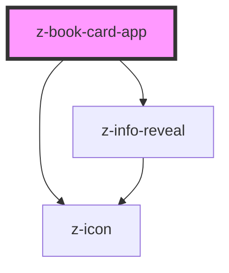

# z-book-card

<!-- Auto Generated Below -->

## Overview

ZBookCardApp component

## Properties

| Property | Attribute | Description                             | Type      | Default     |
| -------- | --------- | --------------------------------------- | --------- | ----------- |
| `info`   | `info`    | Info text to show as inforeveal         | `string`  | `undefined` |
| `laz`    | `laz`     | Show or hide laZ prefix before app name | `boolean` | `true`      |
| `link`   | `link`    | link to the app website                 | `string`  | `undefined` |
| `logo`   | `logo`    | App logo url                            | `string`  | `undefined` |
| `name`   | `name`    | App name                                | `string`  | `undefined` |

## Events

| Event      | Description       | Type               |
| ---------- | ----------------- | ------------------ |
| `appClick` | click on app link | `CustomEvent<any>` |

## Dependencies

### Depends on

- [z-info-reveal](../../z-info-reveal)
- [z-icon](../../z-icon)

### Graph

----------------------------------------------

*Built with [StencilJS](https://stenciljs.com/)*
