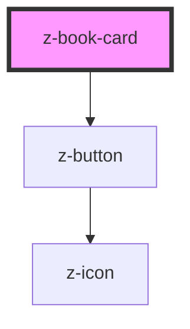

# z-book-card

<!-- Auto Generated Below -->

## Properties

| Property        | Attribute        | Description                                                                                                           | Type                                                    | Default                    |
| --------------- | ---------------- | --------------------------------------------------------------------------------------------------------------------- | ------------------------------------------------------- | -------------------------- |
| `authors`       | `authors`        | [optional] Authors                                                                                                    | `string`                                                | `undefined`                |
| `cover`         | `cover`          | Cover URL                                                                                                             | `string`                                                | `undefined`                |
| `ebookUrl`      | `ebook-url`      | [optional] Show link to the ebook resource. Set title and cover as clickable, opening a new tab to the ebook resource | `string`                                                | `undefined`                |
| `fallbackCover` | `fallback-cover` | [optional] Fallback cover URL                                                                                         | `string`                                                | `undefined`                |
| `isbn`          | `isbn`           | [optional] Main ISBN                                                                                                  | `string`                                                | `undefined`                |
| `isbnLabel`     | `isbn-label`     | [optional] ISBN label                                                                                                 | `string`                                                | `""`                       |
| `operaTitle`    | `opera-title`    | Opera title (card title)                                                                                              | `string`                                                | `undefined`                |
| `titleHtmlTag`  | `title-html-tag` | [optional] Set a specific h level as html tag for opera title                                                         | `string`                                                | `undefined`                |
| `variant`       | `variant`        | Card variant: landscape, portrait                                                                                     | `BookCardVariant.LANDSCAPE \| BookCardVariant.PORTRAIT` | `BookCardVariant.PORTRAIT` |
| `volumeTitle`   | `volume-title`   | [optional] Volume title (card subvolume)                                                                              | `string`                                                | `undefined`                |
| `year`          | `year`           | [optional] year                                                                                                       | `string`                                                | `undefined`                |

## Events

| Event        | Description         | Type               |
| ------------ | ------------------- | ------------------ |
| `coverClick` | click on cover link | `CustomEvent<any>` |
| `ebookClick` | click on ebook link | `CustomEvent<any>` |
| `titleClick` | click on title link | `CustomEvent<any>` |

## Slots

| Slot             | Description                              |
| ---------------- | ---------------------------------------- |
| `"apps"`         | list of card-related apps, default empty |
| `"coverOverlay"` | purple layer on top of book cover        |
| `"cta"`          | top right cta (e.g. bookmark icon)       |
| `"data"`         | external link and pill, default empty    |
| `"ebook"`        | as default, it shows laZ ebook link      |
| `"tags"`         | tags section, default empty              |

## Dependencies

### Depends on

- [z-button](../../z-button)

### Graph

----------------------------------------------

*Built with [StencilJS](https://stenciljs.com/)*
