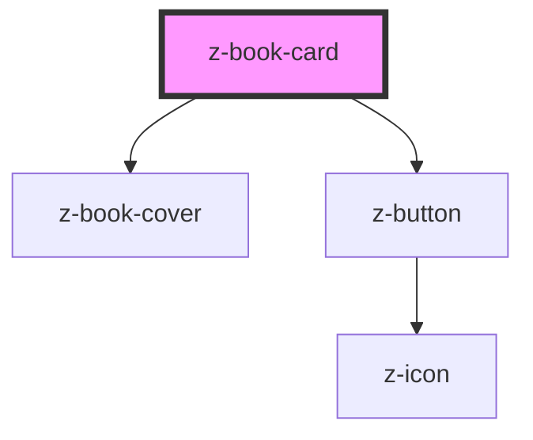

# z-book-card

<!-- Auto Generated Below -->

## Properties

| Property            | Attribute             | Description                                                                                  | Type                                                    | Default                    |
| ------------------- | --------------------- | -------------------------------------------------------------------------------------------- | ------------------------------------------------------- | -------------------------- |
| `authors`           | `authors`             | [optional] Authors                                                                           | `string`                                                | `undefined`                |
| `cover`             | `cover`               | Cover URL                                                                                    | `string`                                                | `undefined`                |
| `ebookUrl`          | `ebook-url`           | [optional] Link to the ebook resource. Creates a link also around the cover and title.       | `string`                                                | `undefined`                |
| `fallbackCover`     | `fallback-cover`      | [optional] Fallback cover URL.                                                               | `string`                                                | `undefined`                |
| `hasMultipleCovers` | `has-multiple-covers` | Whether to show a stack of covers to represent multiple books (only for `portrait` variant). | `boolean`                                               | `false`                    |
| `isbn`              | `isbn`                | [optional] Main ISBN                                                                         | `string`                                                | `undefined`                |
| `isbnLabel`         | `isbn-label`          | [optional] ISBN label                                                                        | `string`                                                | `""`                       |
| `linkTarget`        | `link-target`         | [optional] Value for the `target` attribute of the links created by `ebookUrl` prop.         | `string`                                                | `"_blank"`                 |
| `operaTitle`        | `opera-title`         | Opera title (card title)                                                                     | `string`                                                | `undefined`                |
| `titleHtmlTag`      | `title-html-tag`      | [optional] Set a specific heading level as html tag for the title.                           | `string`                                                | `undefined`                |
| `variant`           | `variant`             | Card variant: landscape, portrait                                                            | `BookCardVariant.LANDSCAPE \| BookCardVariant.PORTRAIT` | `BookCardVariant.PORTRAIT` |
| `volumeTitle`       | `volume-title`        | [optional] Volume title (card subvolume)                                                     | `string`                                                | `undefined`                |
| `year`              | `year`                | [optional] year                                                                              | `string`                                                | `undefined`                |

## Events

| Event        | Description         | Type               |
| ------------ | ------------------- | ------------------ |
| `coverClick` | click on cover link | `CustomEvent<any>` |
| `ebookClick` | click on ebook link | `CustomEvent<any>` |
| `titleClick` | click on title link | `CustomEvent<any>` |

## Slots

| Slot             | Description                                                  |
| ---------------- | ------------------------------------------------------------ |
| `"apps"`         | List of card-related apps, default empty                     |
| `"coverOverlay"` | Content to be displayed in the `z-book-cover` component slot |
| `"cta"`          | Top right cta (e.g. bookmark icon)                           |
| `"data"`         | External link and pill, default empty                        |
| `"ebook"`        | As default, it shows laZ ebook link                          |
| `"tags"`         | Tags section, default empty                                  |

## Dependencies

### Depends on

- [z-book-cover](../../z-book-cover)
- [z-button](../../z-button)

### Graph

----------------------------------------------

*Built with [StencilJS](https://stenciljs.com/)*
