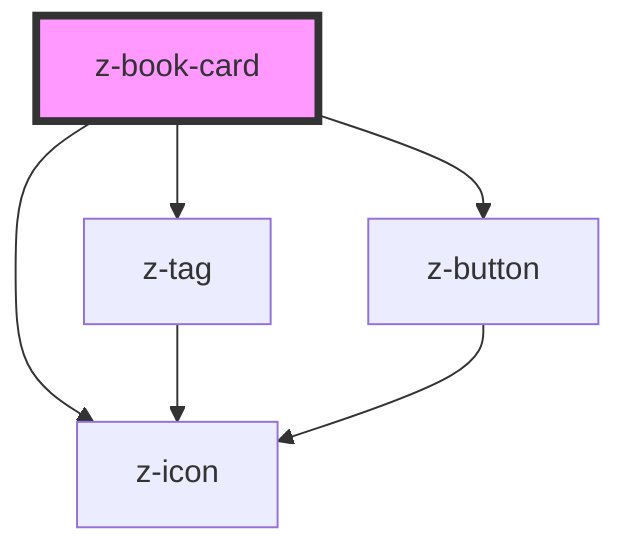

# z-book-card

<!-- Auto Generated Below -->

## Properties

| Property            | Attribute              | Description                                                   | Type                                                             | Default                    |
| ------------------- | ---------------------- | ------------------------------------------------------------- | ---------------------------------------------------------------- | -------------------------- |
| `adoption`          | `adoption`             | [optional] Show adoption badge                                | `boolean`                                                        | `false`                    |
| `annotated`         | `annotated`            | [optional] Annotated tag                                      | `string \| { status: BookCardTagStatus; interactive: boolean; }` | `undefined`                |
| `authors`           | `authors`              | [optional] Authors                                            | `string`                                                         | `undefined`                |
| `catalogUrl`        | `catalog-url`          | [optional] Show catalog link to correspondent resource        | `string`                                                         | `undefined`                |
| `cover`             | `cover`                | Cover URL                                                     | `string`                                                         | `undefined`                |
| `ebookUrl`          | `ebook-url`            | [optional] Show link to the ebook resource                    | `string`                                                         | `undefined`                |
| `edi`               | `edi`                  | [optional] EDI tag                                            | `string \| { status: BookCardTagStatus; interactive: boolean; }` | `undefined`                |
| `fallbackCover`     | `fallback-cover`       | [optional] Fallback cover URL                                 | `string`                                                         | `undefined`                |
| `isbn`              | `isbn`                 | [optional] Main ISBN                                          | `string`                                                         | `undefined`                |
| `isbnLabel`         | `isbn-label`           | [optional] ISBN label                                         | `string`                                                         | `""`                       |
| `operaTitle`        | `opera-title`          | [optional] Opera title                                        | `string`                                                         | `undefined`                |
| `operaTitleHtmlTag` | `opera-title-html-tag` | [optional] Set a specific h level as html tag for opera title | `string`                                                         | `undefined`                |
| `reflowable`        | `reflowable`           | [optional] Show reflowable description                        | `boolean`                                                        | `false`                    |
| `teacherVersion`    | `teacher-version`      | [optional] Teacher version tag                                | `string \| { status: BookCardTagStatus; interactive: boolean; }` | `undefined`                |
| `variant`           | `variant`              | Card variant: landscape, portrait                             | `BookCardVariant.LANDSCAPE \| BookCardVariant.PORTRAIT`          | `BookCardVariant.PORTRAIT` |
| `volumeTitle`       | `volume-title`         | [optional] Volume title                                       | `string`                                                         | `undefined`                |

## Events

| Event                  | Description               | Type               |
| ---------------------- | ------------------------- | ------------------ |
| `catalogClick`         | click on catalog link     | `CustomEvent<any>` |
| `ebookClick`           | click on ebook link       | `CustomEvent<any>` |
| `immersiveReaderClick` | click on immersive reader | `CustomEvent<any>` |
| `tagClick`             | click on tag              | `CustomEvent<any>` |

## Slots

| Slot             | Description                                                        |
| ---------------- | ------------------------------------------------------------------ |
| `"apps"`         | list of card-related apps                                          |
| `"coverOverlay"` | to be shown on top of book cover                                   |
| `"cta"`          | to the right of authors and title (e.g. bookmark icon)             |
| `"ebook"`        | main action slot on the card (as default, it shows laZ ebook link) |

## Dependencies

### Depends on

- [z-tag](../../z-tag)
- [z-icon](../../z-icon)
- [z-button](../../z-button)

### Graph

----------------------------------------------

*Built with [StencilJS](https://stenciljs.com/)*
