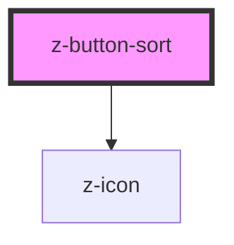

# z-button-sort

<!-- readme-group="buttons" -->

```html
<z-button-sort label="Chimica" counter="3"></z-button-sort>
<z-button-sort label="Biologia" counter="5"></z-button-sort>
<z-button-sort label="Label"></z-button-sort>
<z-button-sort label="Selected" isselected=true></z-button-sort>
<z-button-sort label="Selected" isselected=true sortasc=false></z-button-sort>
<z-button-sort label="Sort number" sortlabelasc="1-9" sortlabeldesc="9-1"></z-button-sort>
<z-button-sort label="Ordina ASC" desclabel="Ordina DESC" sortlabelasc="" sortlabeldesc=""></z-button-sort>
```


<!-- Auto Generated Below -->


## Properties

| Property        | Attribute       | Description                                | Type      | Default      |
| --------------- | --------------- | ------------------------------------------ | --------- | ------------ |
| `buttonid`      | `buttonid`      | id, should be unique                       | `string`  | `undefined`  |
| `counter`       | `counter`       | occurrencies counter (optional)            | `number`  | `undefined`  |
| `desclabel`     | `desclabel`     | label content (descending)                 | `string`  | `this.label` |
| `isselected`    | `isselected`    | selected flag (optional)                   | `boolean` | `false`      |
| `label`         | `label`         | label content (ascending)                  | `string`  | `undefined`  |
| `sortasc`       | `sortasc`       | sortable flag (optional)                   | `boolean` | `true`       |
| `sortlabelasc`  | `sortlabelasc`  | sort label content (ascending) (optional)  | `string`  | `"A-Z"`      |
| `sortlabeldesc` | `sortlabeldesc` | sort label content (descending) (optional) | `string`  | `"Z-A"`      |


## Events

| Event             | Description                                                 | Type               |
| ----------------- | ----------------------------------------------------------- | ------------------ |
| `buttonSortClick` | sorting direction click event, returns buttonid and sortAsc | `CustomEvent<any>` |


## Dependencies

### Depends on

- [z-icon](../../icons/z-icon)

### Graph


----------------------------------------------

*Built with [StencilJS](https://stenciljs.com/)*
