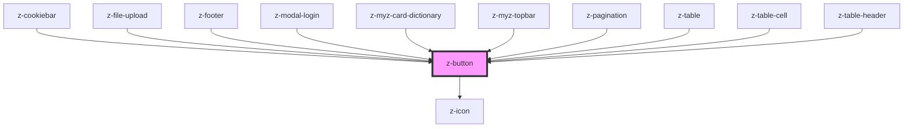

# z-button

<!-- readme-group="buttons" -->

```html
<z-button
  label="button"
  type="primary"
></z-button>
<z-button
  label="button"
  type="primary"
  icon="download"
></z-button>
<z-button
  label="button"
  type="primary"
  isdisabled
  icon="download"
></z-button>
<z-button
  label="button"
  type="secondary"
></z-button>
<z-button
  label="button"
  type="secondary"
  isdisabled
></z-button>
<z-button
  label="button"
  type="tertiary"
></z-button>
<z-button
  label="button"
  type="tertiary"
  isdisabled
></z-button>
<z-button
  label="button"
  type="primary"
  issmall
></z-button>
<z-button
  label="button"
  type="primary"
  issmall
  icon="download"
></z-button>
<z-button
  label="button"
  type="primary"
  issmall
  isdisabled
  icon="download"
></z-button>
<z-button
  label="button"
  type="secondary"
  issmall
></z-button>
<z-button
  label="button"
  type="secondary"
  issmall
  isdisabled
></z-button>
<z-button
  label="button"
  type="tertiary"
  issmall
></z-button>
<z-button
  label="button"
  type="tertiary"
  issmall
  isdisabled
></z-button>
```

<!-- Auto Generated Below -->

## Properties

| Property    | Attribute    | Description                                                                        | Type                                                                                                                            | Default                     |
| ----------- | ------------ | ---------------------------------------------------------------------------------- | ------------------------------------------------------------------------------------------------------------------------------- | --------------------------- |
| `ariaLabel` | `aria-label` | defines a string value that labels an interactive element, used for accessibility. | `string`                                                                                                                        | `undefined`                 |
| `disabled`  | `disabled`   | HTML button disabled attribute.                                                    | `boolean`                                                                                                                       | `false`                     |
| `href`      | `href`       | HTML <a> href attribute. If it is set, it renders an HTML <a> tag.                 | `string`                                                                                                                        | `undefined`                 |
| `htmlid`    | `htmlid`     | Identifier, should be unique.                                                      | `string`                                                                                                                        | `undefined`                 |
| `icon`      | `icon`       | `z-icon` name to use (optional).                                                   | `string`                                                                                                                        | `undefined`                 |
| `name`      | `name`       | HTML button name attribute.                                                        | `string`                                                                                                                        | `undefined`                 |
| `size`      | `size`       | Available sizes: `big`, `small` and `x-small`. Defaults to `big`.                  | `ButtonSizeEnum.big \| ButtonSizeEnum.small \| typeof ButtonSizeEnum["x-small"]`                                                | `ButtonSizeEnum.big`        |
| `target`    | `target`     | HTML a target attribute.                                                           | `string`                                                                                                                        | `undefined`                 |
| `type`      | `type`       | HTML button type attribute.                                                        | `string`                                                                                                                        | `ButtonTypeEnum.button`     |
| `variant`   | `variant`    | Graphical variant: `primary`, `secondary`, `tertiary`. Defaults to `primary`.      | `ButtonVariantEnum.primary \| ButtonVariantEnum.secondary \| ButtonVariantEnum.tertiary \| typeof ButtonVariantEnum["dark-bg"]` | `ButtonVariantEnum.primary` |

## Slots

| Slot | Description  |
| ---- | ------------ |
|      | button label |

## Dependencies

### Used by

- [z-cookiebar](../../notification/z-cookiebar)
- [z-file-upload](../../file-upload/z-file-upload)
- [z-footer](../../footer/z-footer)
- [z-modal-login](../../modal/z-modal-login)
- [z-myz-card-dictionary](../../../snowflakes/myz/card/z-myz-card-dictionary)
- [z-myz-topbar](../../../snowflakes/myz/topbar)
- [z-pagination](../../z-pagination)
- [z-table](../../z-table/z-table)
- [z-table-cell](../../z-table/z-table-cell)
- [z-table-header](../../z-table/z-table-header)

### Depends on

- [z-icon](../../icons/z-icon)

### Graph



---

_Built with [StencilJS](https://stenciljs.com/)_
