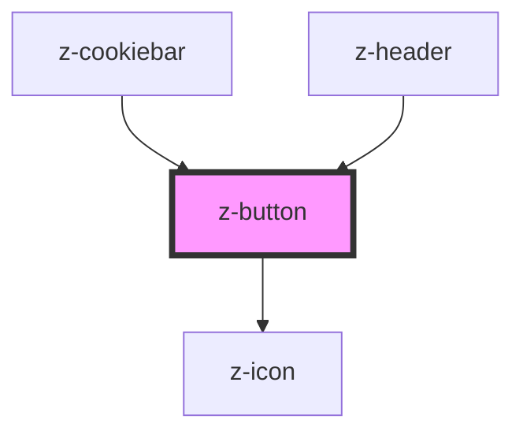

# z-button

<!-- readme-group="buttons" -->

```html
<z-button label="button" type="primary"></z-button>
<z-button label="button" type="primary" icon="download"></z-button>
<z-button label="button" type="primary" isdisabled icon="download"></z-button>
<z-button label="button" type="secondary"></z-button>
<z-button label="button" type="secondary" isdisabled></z-button>
<z-button label="button" type="tertiary"></z-button>
<z-button label="button" type="tertiary" isdisabled></z-button>
<z-button label="button" type="primary" issmall></z-button>
<z-button label="button" type="primary" issmall icon="download"></z-button>
<z-button label="button" type="primary" issmall isdisabled icon="download"></z-button>
<z-button label="button" type="secondary" issmall></z-button>
<z-button label="button" type="secondary" issmall isdisabled></z-button>
<z-button label="button" type="tertiary" issmall></z-button>
<z-button label="button" type="tertiary" issmall isdisabled></z-button>
```
<!-- Auto Generated Below -->


## Properties

| Property   | Attribute  | Description                      | Type                                                                                     | Default                     |
| ---------- | ---------- | -------------------------------- | ---------------------------------------------------------------------------------------- | --------------------------- |
| `disabled` | `disabled` | disable button                   | `boolean`                                                                                | `false`                     |
| `htmlid`   | `htmlid`   | id, should be unique             | `string`                                                                                 | `undefined`                 |
| `icon`     | `icon`     | add an icon to button (optional) | `string`                                                                                 | `undefined`                 |
| `issmall`  | `issmall`  | reduce button size (optional)    | `boolean`                                                                                | `false`                     |
| `name`     | `name`     | name                             | `string`                                                                                 | `undefined`                 |
| `type`     | `type`     | button type                      | `string`                                                                                 | `ButtonTypeEnum.button`     |
| `variant`  | `variant`  | graphic variant                  | `ButtonVariantEnum.primary \| ButtonVariantEnum.secondary \| ButtonVariantEnum.tertiary` | `ButtonVariantEnum.primary` |


## Slots

| Slot | Description  |
| ---- | ------------ |
|      | button label |


## Dependencies

### Used by

 - [z-cookiebar](../../notification/z-cookiebar)
 - [z-header](../../navigation/z-header)

### Depends on

- [z-icon](../../icons/z-icon)

### Graph


----------------------------------------------

*Built with [StencilJS](https://stenciljs.com/)*
