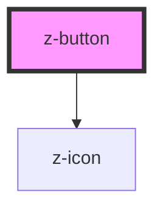

# z-button

<!-- readme-group="buttons" -->

```html
<z-button label="button" type="primary"></z-button>
<z-button label="button" type="primary" icon="download"></z-button>
<z-button label="button" type="primary" isdisabled icon="download"></z-button>
<z-button label="button" type="secondary"></z-button>
<z-button label="button" type="secondary" isdisabled></z-button>
<z-button label="button" type="tertiary"></z-button>
<z-button label="button" type="tertiary" isdisabled></z-button>
<z-button label="button" type="primary" issmall></z-button>
<z-button label="button" type="primary" issmall icon="download"></z-button>
<z-button
  label="button"
  type="primary"
  issmall
  isdisabled
  icon="download"
></z-button>
<z-button label="button" type="secondary" issmall></z-button>
<z-button label="button" type="secondary" issmall isdisabled></z-button>
<z-button label="button" type="tertiary" issmall></z-button>
<z-button label="button" type="tertiary" issmall isdisabled></z-button>
```

<!-- Auto Generated Below -->


## Properties

| Property    | Attribute    | Description                                                                                                                     | Type                                                                                                                            | Default                     |
| ----------- | ------------ | ------------------------------------------------------------------------------------------------------------------------------- | ------------------------------------------------------------------------------------------------------------------------------- | --------------------------- |
| `ariaLabel` | `aria-label` | defines a string value that labels an interactive element, used for accessibility.                                              | `string`                                                                                                                        | `undefined`                 |
| `as`        | `as`         | define whether it renders a button or an a.                                                                                     | `string`                                                                                                                        | `"button"`                  |
| `disabled`  | `disabled`   | HTML button disabled attribute.                                                                                                 | `boolean`                                                                                                                       | `false`                     |
| `href`      | `href`       | HTML a href attribute.                                                                                                          | `string`                                                                                                                        | `""`                        |
| `htmlid`    | `htmlid`     | Identifier, should be unique.                                                                                                   | `string`                                                                                                                        | `undefined`                 |
| `icon`      | `icon`       | `z-icon` name to use (optional).                                                                                                | `string`                                                                                                                        | `undefined`                 |
| `issmall`   | `issmall`    | <span style="color:red">**[DEPRECATED]**</span> Use `size` prop.   TODO: RIMUOVERE???<br/><br/>Reduce button size (deprecated). | `boolean`                                                                                                                       | `false`                     |
| `name`      | `name`       | HTML button name attribute.                                                                                                     | `string`                                                                                                                        | `undefined`                 |
| `size`      | `size`       | Available sizes: `big`, `small` and `x-small`. Defaults to `big`.                                                               | `ButtonSizeEnum.big \| ButtonSizeEnum.small \| typeof ButtonSizeEnum["x-small"]`                                                | `ButtonSizeEnum.big`        |
| `square`    | `square`     | Spy to render square button.                                                                                                    | `boolean`                                                                                                                       | `false`                     |
| `target`    | `target`     | HTML a target attribute.                                                                                                        | `string`                                                                                                                        | `"_blank"`                  |
| `type`      | `type`       | HTML button type attribute.                                                                                                     | `string`                                                                                                                        | `ButtonTypeEnum.button`     |
| `variant`   | `variant`    | Graphical variant: `primary`, `secondary`, `tertiary`, `dark-bg`. Defaults to `primary`.                                        | `ButtonVariantEnum.primary \| ButtonVariantEnum.secondary \| ButtonVariantEnum.tertiary \| typeof ButtonVariantEnum["dark-bg"]` | `ButtonVariantEnum.primary` |


## Slots

| Slot | Description  |
| ---- | ------------ |
|      | button label |


## Dependencies

### Depends on

- [z-icon](../../icons/z-icon)

### Graph


----------------------------------------------

*Built with [StencilJS](https://stenciljs.com/)*
