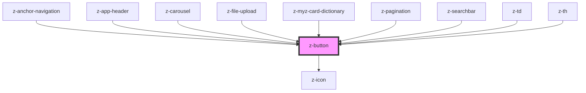

# z-button

<!-- readme-group="buttons" -->

```html
<z-button
  label="button"
  type="primary"
></z-button>
<z-button
  label="button"
  type="primary"
  icon="download"
></z-button>
<z-button
  label="button"
  type="primary"
  isdisabled
  icon="download"
></z-button>
<z-button
  label="button"
  type="secondary"
></z-button>
<z-button
  label="button"
  type="secondary"
  isdisabled
></z-button>
<z-button
  label="button"
  type="tertiary"
></z-button>
<z-button
  label="button"
  type="tertiary"
  isdisabled
></z-button>
<z-button
  label="button"
  type="primary"
  issmall
></z-button>
<z-button
  label="button"
  type="primary"
  issmall
  icon="download"
></z-button>
<z-button
  label="button"
  type="primary"
  issmall
  isdisabled
  icon="download"
></z-button>
<z-button
  label="button"
  type="secondary"
  issmall
></z-button>
<z-button
  label="button"
  type="secondary"
  issmall
  isdisabled
></z-button>
<z-button
  label="button"
  type="tertiary"
  issmall
></z-button>
<z-button
  label="button"
  type="tertiary"
  issmall
  isdisabled
></z-button>
```

<!-- Auto Generated Below -->


## Properties

| Property    | Attribute    | Description                                                                        | Type                                                                                                                      | Default                 |
| ----------- | ------------ | ---------------------------------------------------------------------------------- | ------------------------------------------------------------------------------------------------------------------------- | ----------------------- |
| `ariaLabel` | `aria-label` | defines a string value that labels an interactive element, used for accessibility. | `string`                                                                                                                  | `""`                    |
| `disabled`  | `disabled`   | HTML button disabled attribute.                                                    | `boolean`                                                                                                                 | `false`                 |
| `href`      | `href`       | HTML <a> href attribute. If it is set, it renders an HTML <a> tag.                 | `string`                                                                                                                  | `undefined`             |
| `htmlid`    | `htmlid`     | Identifier, should be unique.                                                      | `string`                                                                                                                  | `undefined`             |
| `icon`      | `icon`       | `z-icon` name to use (optional).                                                   | `string`                                                                                                                  | `undefined`             |
| `name`      | `name`       | HTML button name attribute.                                                        | `string`                                                                                                                  | `undefined`             |
| `role`      | `role`       | defines role attribute, used for accessibility.                                    | `string`                                                                                                                  | `""`                    |
| `size`      | `size`       | Available sizes: `big`, `small` and `x-small`. Defaults to `big`.                  | `ButtonSize.BIG \| ButtonSize.SMALL \| ButtonSize.X_SMALL \| ControlSize.BIG \| ControlSize.SMALL \| ControlSize.X_SMALL` | `ControlSize.BIG`       |
| `target`    | `target`     | HTML a target attribute.                                                           | `string`                                                                                                                  | `undefined`             |
| `type`      | `type`       | HTML button type attribute.                                                        | `ButtonType.BUTTON \| ButtonType.RESET \| ButtonType.SUBMIT`                                                              | `ButtonType.BUTTON`     |
| `variant`   | `variant`    | Graphical variant: `primary`, `secondary`, `tertiary`. Defaults to `primary`.      | `ButtonVariant.PRIMARY \| ButtonVariant.SECONDARY \| ButtonVariant.TERTIARY`                                              | `ButtonVariant.PRIMARY` |


## Slots

| Slot | Description  |
| ---- | ------------ |
|      | button label |


## Dependencies

### Used by

 - [z-anchor-navigation](../../z-anchor-navigation)
 - [z-app-header](../../navigation/z-app-header)
 - [z-carousel](../../z-carousel)
 - [z-file-upload](../../file-upload/z-file-upload)
 - [z-myz-card-dictionary](../../../snowflakes/myz/card/z-myz-card-dictionary)
 - [z-pagination](../../z-pagination)
 - [z-searchbar](../../inputs/z-searchbar)
 - [z-td](../../table/cells/z-td)
 - [z-th](../../table/cells/z-th)

### Depends on

- [z-icon](../../icons/z-icon)

### Graph


----------------------------------------------

*Built with [StencilJS](https://stenciljs.com/)*
