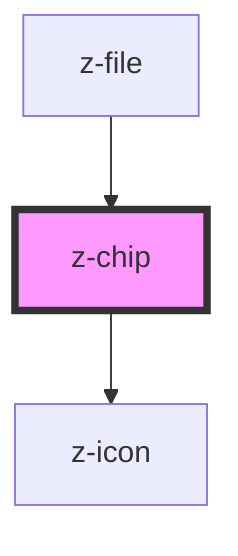

# z-chip

<!-- Auto Generated Below -->

## Properties

| Property          | Attribute          | Description | Type                                                       | Default             |
| ----------------- | ------------------ | ----------- | ---------------------------------------------------------- | ------------------- |
| `disabled`        | `disabled`         |             | `boolean`                                                  | `false`             |
| `icon`            | `icon`             |             | `string`                                                   | `undefined`         |
| `interactiveIcon` | `interactive-icon` |             | `string`                                                   | `undefined`         |
| `type`            | `type`             |             | `ZChipType.default \| ZChipType.medium \| ZChipType.small` | `ZChipType.default` |

## Events

| Event                  | Description | Type               |
| ---------------------- | ----------- | ------------------ |
| `interactiveIconClick` |             | `CustomEvent<any>` |

## Dependencies

### Used by

 - [z-file](../../file-upload/z-file)

### Depends on

- [z-icon](../../icons/z-icon)

### Graph

----------------------------------------------

*Built with [StencilJS](https://stenciljs.com/)*
