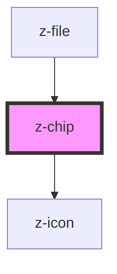

# z-chip

<!-- Auto Generated Below -->

## Properties

| Property          | Attribute          | Description                                       | Type                                                       | Default             |
| ----------------- | ------------------ | ------------------------------------------------- | ---------------------------------------------------------- | ------------------- |
| `ariaLabel`       | `aria-label`       | z-chip aria-label string                          | `string`                                                   | `""`                |
| `disabled`        | `disabled`         | set z-chip as disabled                            | `boolean`                                                  | `false`             |
| `icon`            | `icon`             | Non interactive icon                              | `string`                                                   | `undefined`         |
| `interactiveIcon` | `interactive-icon` | z-chip interactive icon                           | `string`                                                   | `undefined`         |
| `type`            | `type`             | z-chip size type, can be default, medium or small | `ZChipType.DEFAULT \| ZChipType.MEDIUM \| ZChipType.SMALL` | `ZChipType.DEFAULT` |

## Events

| Event                  | Description               | Type               |
| ---------------------- | ------------------------- | ------------------ |
| `interactiveIconClick` | click on interactive icon | `CustomEvent<any>` |

## Dependencies

### Used by

 - [z-file](../../file-upload/z-file)

### Depends on

- [z-icon](../../z-icon)

### Graph

----------------------------------------------

*Built with [StencilJS](https://stenciljs.com/)*
