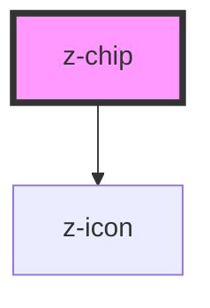

# z-chip

<!-- Auto Generated Below -->

## Properties

| Property       | Attribute       | Description              | Type                                                       | Default             |
| -------------- | --------------- | ------------------------ | ---------------------------------------------------------- | ------------------- |
| `bold`         | `bold`          |                          | `boolean`                                                  | `false`             |
| `disabled`     | `disabled`      |                          | `boolean`                                                  | `false`             |
| `icon`         | `icon`          |                          | `string`                                                   | `undefined`         |
| `iconPosition` | `icon-position` |                          | `"left" \| "right"`                                        | `"left"`            |
| `interaction`  | `interaction`   | z-chip interaction props | `boolean`                                                  | `false`             |
| `label`        | `label`         |                          | `string`                                                   | `undefined`         |
| `type`         | `type`          |                          | `ZChipType.default \| ZChipType.medium \| ZChipType.small` | `ZChipType.default` |

## Dependencies

### Depends on

- [z-icon](../../icons/z-icon)

### Graph

----------------------------------------------

*Built with [StencilJS](https://stenciljs.com/)*
