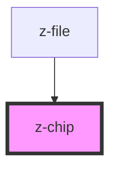

# z-chip

<!-- Auto Generated Below -->

## Properties

| Property      | Attribute     | Description | Type                                  | Default     |
| ------------- | ------------- | ----------- | ------------------------------------- | ----------- |
| `boldtext`    | `boldtext`    |             | `number`                              | `undefined` |
| `disabled`    | `disabled`    |             | `boolean`                             | `false`     |
| `filter`      | `filter`      |             | `boolean`                             | `false`     |
| `regulartext` | `regulartext` |             | `string`                              | `undefined` |
| `type`        | `type`        |             | `ZChipType.default \| ZChipType.mini` | `undefined` |

## Dependencies

### Used by

 - [z-file](../../file-upload/z-file)

### Graph

----------------------------------------------

*Built with [StencilJS](https://stenciljs.com/)*
