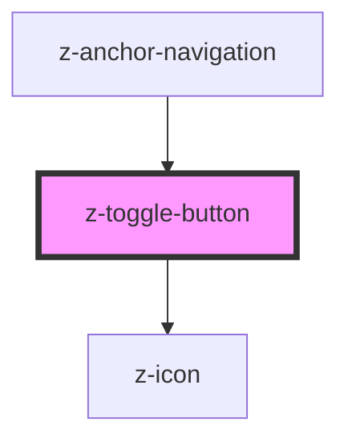

# z-toggle-button

<!-- readme-group="buttons" -->

```html
<z-toggle-button
  label="risorse"
  slot="toggle"
></z-toggle-button>
<z-toggle-button
  label="risorse"
  slot="toggle"
  avoidclick="true"
></z-toggle-button>
<z-toggle-button
  label="risorse"
  slot="toggle"
  isdisabled="true"
  avoidclick="true"
></z-toggle-button>
```

<!-- Auto Generated Below -->


## Properties

| Property     | Attribute    | Description                 | Type      | Default     |
| ------------ | ------------ | --------------------------- | --------- | ----------- |
| `avoidclick` | `avoidclick` | avoidclick status flag      | `boolean` | `undefined` |
| `isdisabled` | `isdisabled` | Disabled status             | `boolean` | `false`     |
| `label`      | `label`      | Label text                  | `string`  | `undefined` |
| `opened`     | `opened`     | Toggle status of the button | `boolean` | `false`     |


## Events

| Event         | Description                                            | Type               |
| ------------- | ------------------------------------------------------ | ------------------ |
| `toggleClick` | Emitted on toggle button click, returns `opened` value | `CustomEvent<any>` |


## Dependencies

### Used by

 - [z-anchor-navigation](../../z-anchor-navigation)

### Depends on

- [z-icon](../../icons/z-icon)

### Graph


----------------------------------------------

*Built with [StencilJS](https://stenciljs.com/)*
