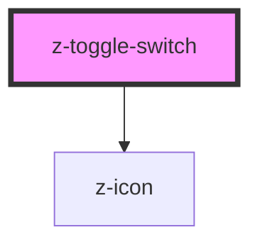

# z-toggle-switch

<!-- Auto Generated Below -->

## Properties

| Property        | Attribute        | Description                                       | Type                                          | Default                          |
| --------------- | ---------------- | ------------------------------------------------- | --------------------------------------------- | -------------------------------- |
| `checked`       | `checked`        | Checked state                                     | `boolean`                                     | `false`                          |
| `disabled`      | `disabled`       | Disabled flag                                     | `boolean`                                     | `false`                          |
| `htmlid`        | `htmlid`         | HTML id attribute to set to the internal checkbox | `string`                                      | `toggle-switch-id-${randomId()}` |
| `labelPosition` | `label-position` | Label position                                    | `LabelPositions.LEFT \| LabelPositions.RIGHT` | `LabelPositions.LEFT`            |

## Events

| Event         | Description        | Type               |
| ------------- | ------------------ | ------------------ |
| `toggleClick` | Toggle click event | `CustomEvent<any>` |

## Dependencies

### Depends on

- [z-icon](../../icons/z-icon)

### Graph

---

_Built with [StencilJS](https://stenciljs.com/)_
