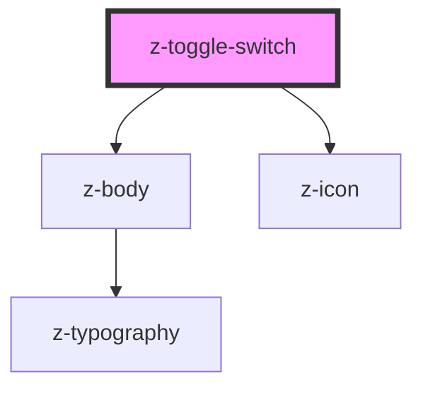

# z-toggle-switch

<!-- Auto Generated Below -->

## Properties

| Property        | Attribute       | Description | Type      | Default              |
| --------------- | --------------- | ----------- | --------- | -------------------- |
| `checked`       | `checked`       |             | `boolean` | `false`              |
| `disabled`      | `disabled`      |             | `boolean` | `false`              |
| `htmlid`        | `htmlid`        |             | `string`  | ``id-${randomId()}`` |
| `labelposition` | `labelposition` |             | `boolean` | `false`              |

## Events

| Event         | Description | Type               |
| ------------- | ----------- | ------------------ |
| `toggleClick` |             | `CustomEvent<any>` |

## Dependencies

### Depends on

- [z-body](../../typography/z-body)
- [z-icon](../../icons/z-icon)

### Graph

----------------------------------------------

*Built with [StencilJS](https://stenciljs.com/)*
