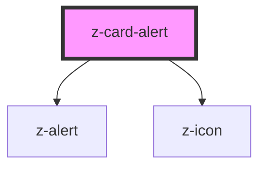

# z-card-alert

<!-- readme-group="card" -->

```html
<z-card-alert
  slot="alert"
  iconName="circle-check"
  contenttext="Libro aggiunto ai miei libri"
  actiontext="Annulla"
  type="add"
></z-card-alert>
<z-card-alert
  slot="alert"
  iconName="circle-check"
  contenttext="Libro rimosso dai tuoi libri"
  actiontext="annulla"
  type="remove"
  faded="true"
></z-card-alert>
<z-card-alert
  slot="alert"
  iconName="circle-check"
  contenttext="Libro rimosso dai tuoi libri"
  type="remove"
  faded="true"
></z-card-alert>
<z-card-alert
  slot="alert"
  iconName="circle-check"
  contenttext="Libro aggiunto ai miei libri"
  type="add"
></z-card-alert>
```

<!-- Auto Generated Below -->


## Properties

| Property      | Attribute     | Description        | Type     | Default     |
| ------------- | ------------- | ------------------ | -------- | ----------- |
| `actiontext`  | `actiontext`  | action button text | `string` | `undefined` |
| `contenttext` | `contenttext` | content text       | `string` | `undefined` |
| `iconname`    | `iconname`    | icon name          | `string` | `undefined` |
| `type`        | `type`        | alert variant type | `string` | `undefined` |


## Events

| Event        | Description                                          | Type               |
| ------------ | ---------------------------------------------------- | ------------------ |
| `undoAction` | undo action click/keyboard event, returns actionType | `CustomEvent<any>` |


## Dependencies

### Depends on

- [z-alert](../../notification/z-alert)
- [z-icon](../../icons/z-icon)

### Graph


----------------------------------------------

*Built with [StencilJS](https://stenciljs.com/)*
