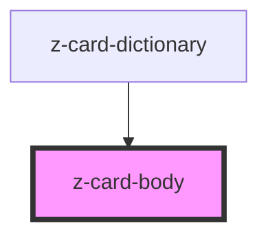

# z-card-body

<!-- readme-group="card" -->

```html
<z-card-body>{alert slot}{cover slot}</z-card-body>
```

<!-- Auto Generated Below -->


## Slots

| Slot      | Description     |
| --------- | --------------- |
| `"alert"` | card alert slot |
| `"cover"` | book cover slot |


## Dependencies

### Used by

 - [z-card-dictionary](../z-card-dictionary)

### Graph


----------------------------------------------

*Built with [StencilJS](https://stenciljs.com/)*
