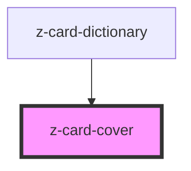

# z-card-cover

<!-- readme-group="card" -->
```html
<z-card-cover slot="cover" titolo="titolo" img="https://staticmy.zanichelli.it/catalogo/assets/m40001.9788808720740.jpg" />
<z-card-cover slot="cover" titolo="titolo" img="https://staticmy.zanichelli.it/catalogo/assets/m40001.9788808720740.jpg" faded=true />
<z-card-cover slot="cover" titolo="titolo" img="https://staticmy.zanichelli.it/catalogo/assets/m40001.9788808720740.jpg" faded=true defaultimg="/assets/fallback_image.jpg" />
```

<!-- Auto Generated Below -->


## Properties

| Property     | Attribute    | Description                | Type      | Default     |
| ------------ | ------------ | -------------------------- | --------- | ----------- |
| `defaultimg` | `defaultimg` | default error image source | `string`  | `undefined` |
| `faded`      | `faded`      | faded status               | `boolean` | `undefined` |
| `img`        | `img`        | image source               | `string`  | `undefined` |
| `titolo`     | `titolo`     | cover alt title            | `string`  | `undefined` |


## Dependencies

### Used by

 - [z-card-dictionary](../z-card-dictionary)

### Graph


----------------------------------------------

*Built with [StencilJS](https://stenciljs.com/)*
