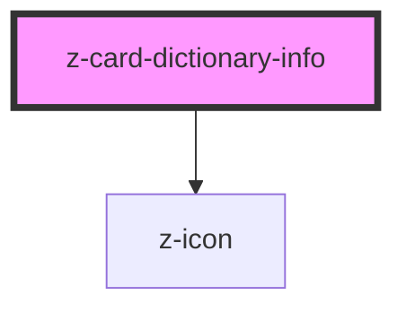

# z-card-dictionary-info

<!-- Auto Generated Below -->

## Properties

| Property | Attribute | Description     | Type                                                                                                                                                             | Default     |
| -------- | --------- | --------------- | ---------------------------------------------------------------------------------------------------------------------------------------------------------------- | ----------- |
| `data`   | `data`    | dictionary info | `string \| { author: string; year: string; title: string; description: string; online_license: DictionaryLicenseData; offline_license: DictionaryLicenseData; }` | `undefined` |

## Events

| Event       | Description        | Type               |
| ----------- | ------------------ | ------------------ |
| `closeInfo` | flip card to front | `CustomEvent<any>` |

## Slots

| Slot | Description |
| ---- | ----------- |
|      | content     |

## Dependencies

### Depends on

- [z-icon](../../icons/z-icon)

### Graph

----------------------------------------------

*Built with [StencilJS](https://stenciljs.com/)*
