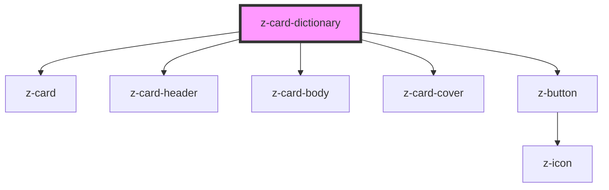

# z-card-dictionary

<!-- Auto Generated Below -->

## Properties

| Property             | Attribute            | Description             | Type      | Default     |
| -------------------- | -------------------- | ----------------------- | --------- | ----------- |
| `cover`              | `cover`              | card cover              | `string`  | `undefined` |
| `disabled`           | `disabled`           | card is disabled        | `boolean` | `false`     |
| `disabledinfobutton` | `disabledinfobutton` | info button is disabled | `boolean` | `false`     |
| `flipbuttonlabel`    | `flipbuttonlabel`    | flip button label       | `string`  | `"INFO"`    |
| `flipped`            | `flipped`            | card is flipped         | `boolean` | `false`     |
| `name`               | `name`               | card title              | `string`  | `undefined` |

## Events

| Event         | Description          | Type               |
| ------------- | -------------------- | ------------------ |
| `cardFlipped` | when card is flipped | `CustomEvent<any>` |

## Slots

| Slot     | Description       |
| -------- | ----------------- |
|          | generic card slot |
| `"info"` | flipped card info |

## Dependencies

### Depends on

- [z-card](../z-card)
- [z-card-header](../z-card-header)
- [z-card-body](../z-card-body)
- [z-card-cover](../z-card-cover)
- [z-button](../../buttons/z-button)

### Graph

----------------------------------------------

*Built with [StencilJS](https://stenciljs.com/)*
