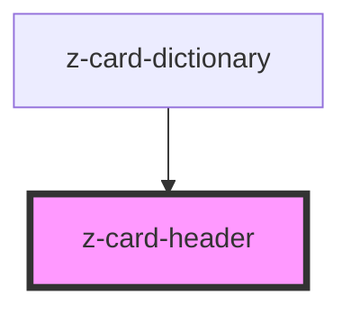

# z-card-header

<!-- readme-group="card" -->
```html
<z-card-header titolo="titolo titolo titolotitolo titolo titolo titolo"></z-card-header>
<z-card-header faded=true titolo="titolo titolo titolotitolo titolo titolo titolo"></z-card-header>
<z-card-header titolo="titolo titolo titolotitolo titolo titolo titolo" cardtype="reale"></z-card-header>
```

<!-- Auto Generated Below -->


## Properties

| Property   | Attribute  | Description                     | Type                                                                       | Default     |
| ---------- | ---------- | ------------------------------- | -------------------------------------------------------------------------- | ----------- |
| `cardtype` | `cardtype` | card graphic variant (optional) | `LicenseTypeEnum.real \| LicenseTypeEnum.trial \| LicenseTypeEnum.virtual` | `undefined` |
| `faded`    | `faded`    | faded status                    | `boolean`                                                                  | `undefined` |
| `titolo`   | `titolo`   | volume title                    | `string`                                                                   | `undefined` |


## Slots

| Slot     | Description           |
| -------- | --------------------- |
| `"icon"` | card header icon slot |


## Dependencies

### Used by

 - [z-card-dictionary](../z-card-dictionary)

### Graph


----------------------------------------------

*Built with [StencilJS](https://stenciljs.com/)*
