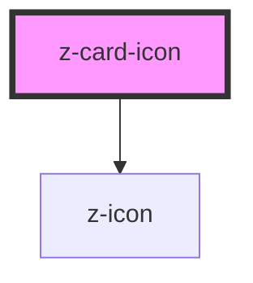

# z-card-icon

<!-- readme-group="card" -->
```html
<z-card-icon icon="book-minus" slot="icon" />
<z-card-icon icon="book-minus" isdisbled="true" slot="icon" />
```

<!-- Auto Generated Below -->


## Properties

| Property     | Attribute    | Description          | Type      | Default     |
| ------------ | ------------ | -------------------- | --------- | ----------- |
| `icon`       | `icon`       | icon name            | `string`  | `undefined` |
| `isdisabled` | `isdisabled` | disabled status flag | `boolean` | `false`     |


## Dependencies

### Depends on

- [z-icon](../../icons/z-icon)

### Graph


----------------------------------------------

*Built with [StencilJS](https://stenciljs.com/)*
