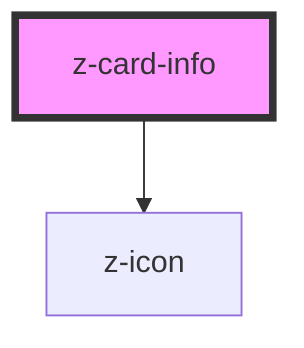

# z-card-info

<!-- Auto Generated Below -->

## Properties

| Property        | Attribute       | Description                         | Type                                                                                                                                                           | Default     |
| --------------- | --------------- | ----------------------------------- | -------------------------------------------------------------------------------------------------------------------------------------------------------------- | ----------- |
| `accessibility` | `accessibility` | active accessibility for close icon | `boolean`                                                                                                                                                      | `false`     |
| `data`          | `data`          | dictionary info                     | `string \| { author: string; year: string; title: string; description: string; onlineLicense: DictionaryLicenseData; offlineLicense: DictionaryLicenseData; }` | `undefined` |

## Events

| Event      | Description        | Type               |
| ---------- | ------------------ | ------------------ |
| `flipCard` | flip card to front | `CustomEvent<any>` |

## Slots

| Slot | Description |
| ---- | ----------- |
|      | content     |

## Dependencies

### Depends on

- [z-icon](../../icons/z-icon)

### Graph

----------------------------------------------

*Built with [StencilJS](https://stenciljs.com/)*
