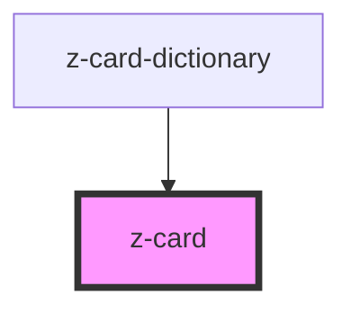

# z-card

<!-- readme-group="card" -->
```html
<z-card>{slot}</z-card>
<z-card faded=true>{slot}</z-card>
<z-card ishighlighted>{slot}</z-card>
<z-card ispressed>{slot}</z-card>
<z-card faded=true>{slot}</z-card>
<z-card cardtype="reale">{slot}</z-card>
<z-card cardtype="reale" ishighlighted>{slot}</z-card>
<z-card cardtype="reale" ispressed>{slot}</z-card>
```

<!-- Auto Generated Below -->


## Properties

| Property        | Attribute       | Description                | Type                                                                       | Default     |
| --------------- | --------------- | -------------------------- | -------------------------------------------------------------------------- | ----------- |
| `cardtype`      | `cardtype`      | graphic variant (optional) | `LicenseTypeEnum.real \| LicenseTypeEnum.trial \| LicenseTypeEnum.virtual` | `undefined` |
| `faded`         | `faded`         | faded status               | `boolean`                                                                  | `undefined` |
| `ishighlighted` | `ishighlighted` | highlighted status         | `boolean`                                                                  | `false`     |
| `ispressed`     | `ispressed`     | pressed status             | `boolean`                                                                  | `false`     |


## Slots

| Slot | Description       |
| ---- | ----------------- |
|      | generic card slot |


## Dependencies

### Used by

 - [z-card-dictionary](../z-card-dictionary)

### Graph


----------------------------------------------

*Built with [StencilJS](https://stenciljs.com/)*
