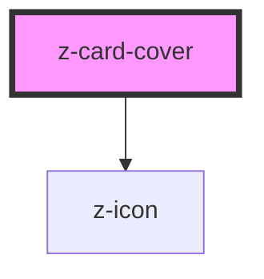

# z-card

<!-- Auto Generated Below -->

## Properties

| Property    | Attribute    | Description                                    | Type      | Default     |
| ----------- | ------------ | ---------------------------------------------- | --------- | ----------- |
| `coverIcon` | `cover-icon` | Name of the icon to place over the image cover | `string`  | `undefined` |
| `overlay`   | `overlay`    |                                                | `boolean` | `false`     |
| `shadowed`  | `shadowed`   |                                                | `boolean` | `false`     |

## Dependencies

### Depends on

- [z-icon](../../icons/z-icon)

### Graph

----------------------------------------------

*Built with [StencilJS](https://stenciljs.com/)*
