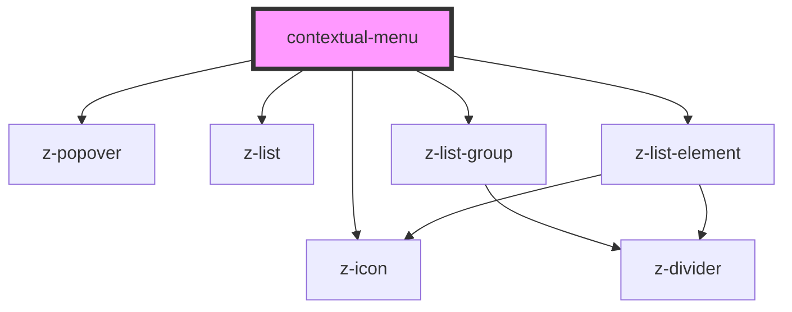

# contextual-menu

<!-- Auto Generated Below -->

## Properties

| Property   | Attribute  | Description                                           | Type     | Default     |
| ---------- | ---------- | ----------------------------------------------------- | -------- | ----------- |
| `elements` | `elements` | deprecated - JSON stringified data to fill the footer | `string` | `undefined` |

## Dependencies

### Depends on

- [z-popover](../z-popover)
- [z-icon](../icons/z-icon)
- [z-list](../list/z-list)
- [z-list-group](../list/z-list-group)
- [z-list-element](../list/z-list-element)

### Graph

----------------------------------------------

*Built with [StencilJS](https://stenciljs.com/)*
