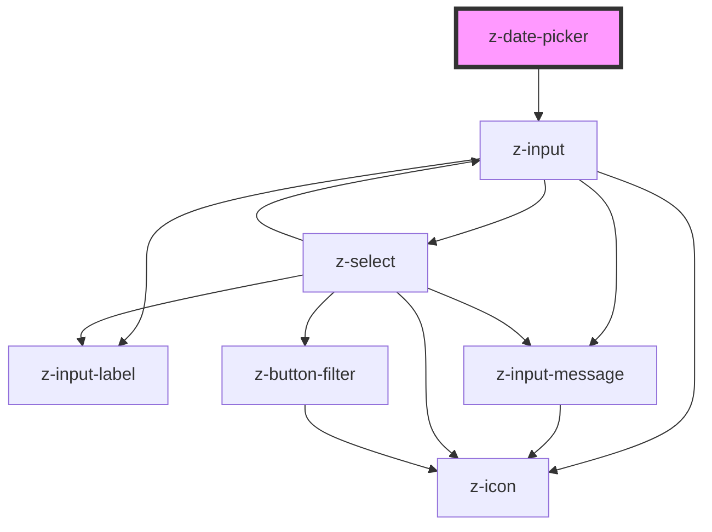

# z-date-picker

<!-- Auto Generated Below -->

## Properties

| Property       | Attribute      | Description                                             | Type                                                                         | Default                |
| -------------- | -------------- | ------------------------------------------------------- | ---------------------------------------------------------------------------- | ---------------------- |
| `ariaLabel`    | `aria-label`   | z-input aria label                                      | `string`                                                                     | `undefined`            |
| `datepickerid` | `datepickerid` | unique id                                               | `string`                                                                     | `undefined`            |
| `label`        | `label`        | z-input label                                           | `string`                                                                     | `undefined`            |
| `mode`         | `mode`         | [Optional] datepicker mode: date, datetime, only months | `ZDatePickerMode.date \| ZDatePickerMode.dateTime \| ZDatePickerMode.months` | `ZDatePickerMode.date` |

## Events

| Event        | Description                                      | Type               |
| ------------ | ------------------------------------------------ | ------------------ |
| `dateSelect` | emitted when date changes, returns selected date | `CustomEvent<any>` |

## Dependencies

### Depends on

- [z-input](../../inputs/z-input)

### Graph

----------------------------------------------

*Built with [StencilJS](https://stenciljs.com/)*
