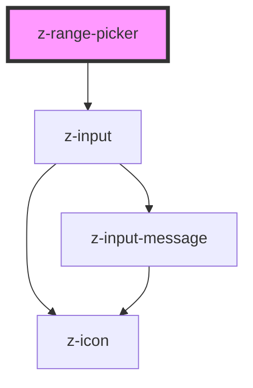

# z-date-picker

<!-- Auto Generated Below -->

## Properties

| Property                 | Attribute                  | Description                                  | Type                                                  | Default                 |
| ------------------------ | -------------------------- | -------------------------------------------- | ----------------------------------------------------- | ----------------------- |
| `firstAriaLabel`         | `first-aria-label`         | first z-input aria label                     | `string`                                              | `undefined`             |
| `firstLabel`             | `first-label`              | first z-input label                          | `string`                                              | `undefined`             |
| `firstPickerPlaceholder` | `first-picker-placeholder` | readonly mode                                | `string`                                              | `""`                    |
| `firstPickerReadOnly`    | `first-picker-read-only`   | readonly mode                                | `boolean`                                             | `false`                 |
| `lastPickerPlaceholder`  | `last-picker-placeholder`  | readonly mode                                | `string`                                              | `""`                    |
| `lastPickerReadOnly`     | `last-picker-read-only`    | readonly mode                                | `boolean`                                             | `false`                 |
| `mode`                   | `mode`                     | [Optional] datepicker mode: date or datetime | `ZRangePickerMode.DATE \| ZRangePickerMode.DATE_TIME` | `ZRangePickerMode.DATE` |
| `rangePickerId`          | `range-picker-id`          | unique id                                    | `string`                                              | `undefined`             |
| `secondAriaLabel`        | `second-aria-label`        | second z-input aria label                    | `string`                                              | `undefined`             |
| `secondLabel`            | `second-label`             | second z-input label                         | `string`                                              | `undefined`             |

## Events

| Event        | Description                                                             | Type               |
| ------------ | ----------------------------------------------------------------------- | ------------------ |
| `dateSelect` | emitted when date changes, returns an array with the two selected dates | `CustomEvent<any>` |

## Dependencies

### Depends on

- [z-input](../../z-input)

### Graph

----------------------------------------------

*Built with [StencilJS](https://stenciljs.com/)*
