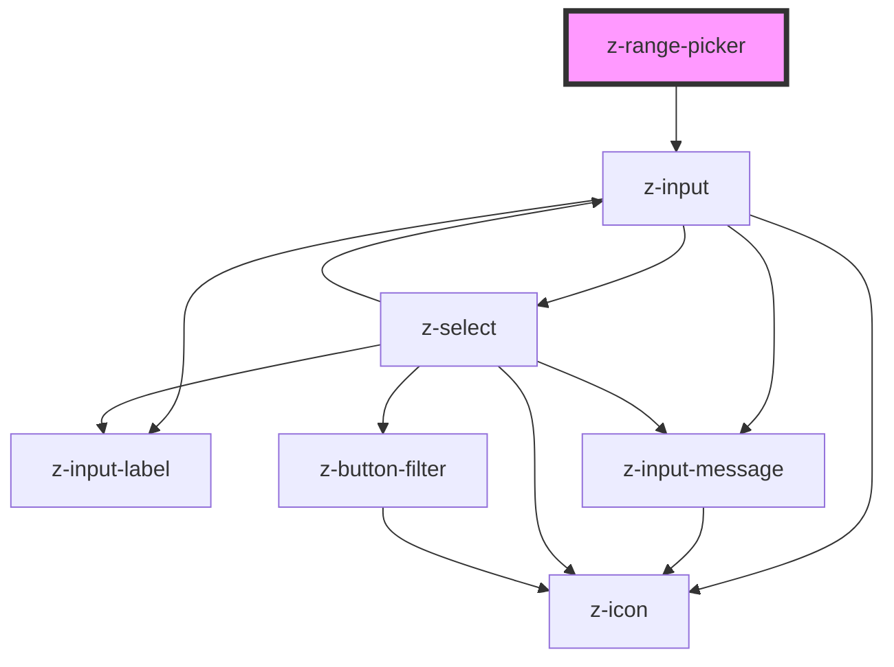

# z-date-picker

<!-- Auto Generated Below -->

## Properties

| Property        | Attribute         | Description                                             | Type                                                                         | Default                |
| --------------- | ----------------- | ------------------------------------------------------- | ---------------------------------------------------------------------------- | ---------------------- |
| `mode`          | `mode`            | [Optional] datepicker mode: date, datetime, only months | `ZDatePickerMode.date \| ZDatePickerMode.dateTime \| ZDatePickerMode.months` | `ZDatePickerMode.date` |
| `rangePickerId` | `range-picker-id` | unique id                                               | `string`                                                                     | `undefined`            |

## Events

| Event        | Description                                      | Type               |
| ------------ | ------------------------------------------------ | ------------------ |
| `dateSelect` | emitted when date changes, returns selected date | `CustomEvent<any>` |

## Dependencies

### Depends on

- [z-input](../../inputs/z-input)

### Graph

----------------------------------------------

*Built with [StencilJS](https://stenciljs.com/)*
