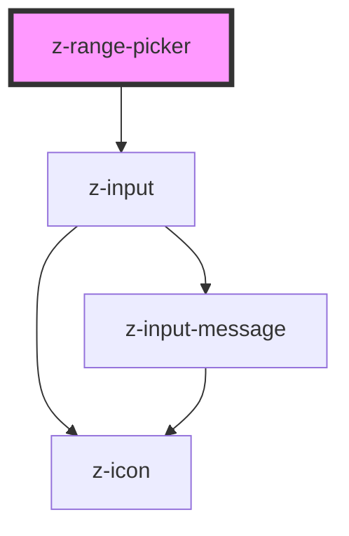

# z-date-picker

<!-- Auto Generated Below -->

## Properties

| Property          | Attribute           | Description                                  | Type                                                 | Default                 |
| ----------------- | ------------------- | -------------------------------------------- | ---------------------------------------------------- | ----------------------- |
| `firstAriaLabel`  | `first-aria-label`  | first z-input aria label                     | `string`                                             | `undefined`             |
| `firstLabel`      | `first-label`       | first z-input label                          | `string`                                             | `undefined`             |
| `mode`            | `mode`              | [Optional] datepicker mode: date or datetime | `ZRangePickerMode.date \| ZRangePickerMode.dateTime` | `ZRangePickerMode.date` |
| `rangePickerId`   | `range-picker-id`   | unique id                                    | `string`                                             | `undefined`             |
| `secondAriaLabel` | `second-aria-label` | second z-input aria label                    | `string`                                             | `undefined`             |
| `secondLabel`     | `second-label`      | second z-input label                         | `string`                                             | `undefined`             |

## Events

| Event        | Description                                                             | Type               |
| ------------ | ----------------------------------------------------------------------- | ------------------ |
| `dateSelect` | emitted when date changes, returns an array with the two selected dates | `CustomEvent<any>` |

## Dependencies

### Depends on

- [z-input](../../inputs/z-input)

### Graph

---

_Built with [StencilJS](https://stenciljs.com/)_
