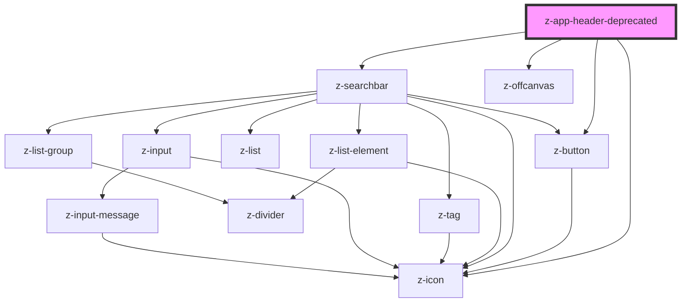

# z-app-header

<!-- Auto Generated Below -->

## Properties

| Property            | Attribute            | Description                                                                                                                                                                                                                                    | Type                               | Default     |
| ------------------- | -------------------- | ---------------------------------------------------------------------------------------------------------------------------------------------------------------------------------------------------------------------------------------------- | ---------------------------------- | ----------- |
| `drawerOpen`        | `drawer-open`        | The opening state of the drawer.                                                                                                                                                                                                               | `boolean`                          | `false`     |
| `enableSearch`      | `enable-search`      | Enable the search bar.                                                                                                                                                                                                                         | `boolean`                          | `false`     |
| `flow`              | `flow`               | Control menu bar position in the header. - auto: the menu bar is positioned near the title - stack: the menu bar is positioned below the title - offcanvas: the menu bar is not displayed and a burger icon appears to open the offcanvas menu | `"auto" \| "offcanvas" \| "stack"` | `"auto"`    |
| `hero`              | `hero`               | Set the hero image source for the header. You can also use a [slot="hero"] node for advanced customization.                                                                                                                                    | `string`                           | `undefined` |
| `overlay`           | `overlay`            | Should place an overlay over the hero image. Useful for legibility purpose.                                                                                                                                                                    | `boolean`                          | `false`     |
| `searchPageUrl`     | `search-page-url`    | Url to the search page. Set this prop and `enableSearch` to show a link-button on mobile and tablet viewports, instead of the normal searchbar. The link will also appear on the sticky header.                                                | `string`                           | `undefined` |
| `searchPlaceholder` | `search-placeholder` | Placeholder text for the search bar.                                                                                                                                                                                                           | `string`                           | `"Cerca"`   |
| `searchString`      | `search-string`      | Search string for the search bar.                                                                                                                                                                                                              | `string`                           | `""`        |
| `stuck`             | `stuck`              | Stuck mode for the header. You can programmatically set it using an IntersectionObserver.                                                                                                                                                      | `boolean`                          | `false`     |

## Events

| Event      | Description                                          | Type               |
| ---------- | ---------------------------------------------------- | ------------------ |
| `sticking` | Emitted when the `stuck` state of the header changes | `CustomEvent<any>` |

## Slots

| Slot              | Description                                                                    |
| ----------------- | ------------------------------------------------------------------------------ |
| `"stucked-title"` | Title for the stuck header. By default it uses the text from the `title` slot. |
| `"subtitle"`      | Slot for the bottom subtitle. It will not appear in stuck header.              |
| `"title"`         | Slot for the main title                                                        |
| `"top-subtitle"`  | Slot for the top subtitle. It will not appear in stuck header.                 |

## CSS Custom Properties

| Name                                    | Description                                                                                                                                                                                                                                 |
| --------------------------------------- | ------------------------------------------------------------------------------------------------------------------------------------------------------------------------------------------------------------------------------------------- |
| `--app-header-bg`                       | Header background color. Defaults to `--color-surface01`.                                                                                                                                                                                   |
| `--app-header-content-max-width`        | Use it to set header's content max width. Useful when the project use a fixed width layout. Defaults to `100%`.                                                                                                                             |
| `--app-header-drawer-trigger-size`      | The size of the drawer icon. Defaults to `--space-unit * 4`.                                                                                                                                                                                |
| `--app-header-height`                   | Defaults to `auto`.                                                                                                                                                                                                                         |
| `--app-header-stucked-bg`               | Stuck header background color. Defaults to `--color-surface01`.                                                                                                                                                                             |
| `--app-header-stucked-text-color`       | Stuck header text color. Defaults to `--color-default-text`.                                                                                                                                                                                |
| `--app-header-text-color`               | Text color. Useful on `hero` variant to set text color based on the colors of the background image. Defaults to `--color-default-text`.                                                                                                     |
| `--app-header-title-font-size`          | Variable to customize the title's font size. NOTE: Only use one of the exported `--app-header-typography-*-size` as a value. Defaults to `--app-header-typography-3-size`.                                                                  |
| `--app-header-title-letter-spacing`     | Variable to customize the title's letter-spacing. NOTE: Only use one of the exported `--app-header-typography-*-tracking` as a value and use the same level as the one of the font size. Defaults to `--app-header-typography-3-tracking`.  |
| `--app-header-title-lineheight`         | Variable to customize the title's line-height. NOTE: Only use one of the exported `--app-header-typography-*-lineheight` as a value and use the same level as the one of the font size. Defaults to `--app-header-typography-3-lineheight`. |
| `--app-header-top-offset`               | Top offset for the stuck header. Useful when there are other fixed elements above the header. Defaults to `48px` (the height of the main topbar).                                                                                           |
| `--app-header-typography-1-lineheight`  | Part of the heading typography's scale. Use it if you have to override the default value. Value: `1.33`.                                                                                                                                    |
| `--app-header-typography-1-size`        | Part of the heading typography's scale. Use it if you have to override the default value. Value: `24px`.                                                                                                                                    |
| `--app-header-typography-1-tracking`    | Part of the heading typography's scale. Use it if you have to override the default value. Value: `calc(-0.2 / 1em)`.                                                                                                                        |
| `--app-header-typography-10-lineheight` | Part of the heading typography's scale. Use it if you have to override the default value. Value: `1.26`.                                                                                                                                    |
| `--app-header-typography-10-size`       | Part of the heading typography's scale. Use it if you have to override the default value. Value: `76px`.                                                                                                                                    |
| `--app-header-typography-10-tracking`   | Part of the heading typography's scale. Use it if you have to override the default value. Value: `calc(-2 / 1em)`.                                                                                                                          |
| `--app-header-typography-11-lineheight` | Part of the heading typography's scale. Use it if you have to override the default value. Value: `1.2`.                                                                                                                                     |
| `--app-header-typography-11-size`       | Part of the heading typography's scale. Use it if you have to override the default value. Value: `84px`.                                                                                                                                    |
| `--app-header-typography-11-tracking`   | Part of the heading typography's scale. Use it if you have to override the default value. Value: `calc(-2.2 / 1em)`.                                                                                                                        |
| `--app-header-typography-12-lineheight` | Part of the heading typography's scale. Use it if you have to override the default value. Value: `1.2`.                                                                                                                                     |
| `--app-header-typography-12-size`       | Part of the heading typography's scale. Use it if you have to override the default value. Value: `92px`.                                                                                                                                    |
| `--app-header-typography-12-tracking`   | Part of the heading typography's scale. Use it if you have to override the default value. Value: `calc(-2.4 / 1em)`.                                                                                                                        |
| `--app-header-typography-2-lineheight`  | Part of the heading typography's scale. Use it if you have to override the default value. Value: `1.29`.                                                                                                                                    |
| `--app-header-typography-2-size`        | Part of the heading typography's scale. Use it if you have to override the default value. Value: `28px`.                                                                                                                                    |
| `--app-header-typography-2-tracking`    | Part of the heading typography's scale. Use it if you have to override the default value. Value: `calc(-0.4 / 1em)`.                                                                                                                        |
| `--app-header-typography-3-lineheight`  | Part of the heading typography's scale. Use it if you have to override the default value. Value: `1.25`.                                                                                                                                    |
| `--app-header-typography-3-size`        | Part of the heading typography's scale. Use it if you have to override the default value. Value: `32px`.                                                                                                                                    |
| `--app-header-typography-3-tracking`    | Part of the heading typography's scale. Use it if you have to override the default value. Value: `calc(-0.6 / 1em)`.                                                                                                                        |
| `--app-header-typography-4-lineheight`  | Part of the heading typography's scale. Use it if you have to override the default value. Value: `1.24`.                                                                                                                                    |
| `--app-header-typography-4-size`        | Part of the heading typography's scale. Use it if you have to override the default value. Value: `36px`.                                                                                                                                    |
| `--app-header-typography-4-tracking`    | Part of the heading typography's scale. Use it if you have to override the default value. Value: `calc(-0.8 / 1em)`.                                                                                                                        |
| `--app-header-typography-5-lineheight`  | Part of the heading typography's scale. Use it if you have to override the default value. Value: `1.24`.                                                                                                                                    |
| `--app-header-typography-5-size`        | Part of the heading typography's scale. Use it if you have to override the default value. Value: `42px`.                                                                                                                                    |
| `--app-header-typography-5-tracking`    | Part of the heading typography's scale. Use it if you have to override the default value. Value: `calc(-1 / 1em)`.                                                                                                                          |
| `--app-header-typography-6-lineheight`  | Part of the heading typography's scale. Use it if you have to override the default value. Value: `1.25`.                                                                                                                                    |
| `--app-header-typography-6-size`        | Part of the heading typography's scale. Use it if you have to override the default value. Value: `48px`.                                                                                                                                    |
| `--app-header-typography-6-tracking`    | Part of the heading typography's scale. Use it if you have to override the default value. Value: `calc(-1.2 / 1em)`.                                                                                                                        |
| `--app-header-typography-7-lineheight`  | Part of the heading typography's scale. Use it if you have to override the default value. Value: `1.2`.                                                                                                                                     |
| `--app-header-typography-7-size`        | Part of the heading typography's scale. Use it if you have to override the default value. Value: `54px`.                                                                                                                                    |
| `--app-header-typography-7-tracking`    | Part of the heading typography's scale. Use it if you have to override the default value. Value: `calc(-1.4 / 1em)`.                                                                                                                        |
| `--app-header-typography-8-lineheight`  | Part of the heading typography's scale. Use it if you have to override the default value. Value: `1.26`.                                                                                                                                    |
| `--app-header-typography-8-size`        | Part of the heading typography's scale. Use it if you have to override the default value. Value: `60px`.                                                                                                                                    |
| `--app-header-typography-8-tracking`    | Part of the heading typography's scale. Use it if you have to override the default value. Value: `calc(-1.6 / 1em)`.                                                                                                                        |
| `--app-header-typography-9-lineheight`  | Part of the heading typography's scale. Use it if you have to override the default value. Value: `1.24`.                                                                                                                                    |
| `--app-header-typography-9-size`        | Part of the heading typography's scale. Use it if you have to override the default value. Value: `68px`.                                                                                                                                    |
| `--app-header-typography-9-tracking`    | Part of the heading typography's scale. Use it if you have to override the default value. Value: `calc(-1.8 / 1em)`.                                                                                                                        |

## Dependencies

### Depends on

- [z-button](../../z-button)
- [z-searchbar](../../z-searchbar)
- [z-icon](../../z-icon)
- [z-offcanvas](../../z-offcanvas)

### Graph

----------------------------------------------

*Built with [StencilJS](https://stenciljs.com/)*
