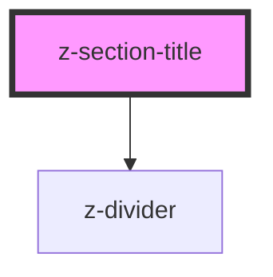

# z-section-title

<!-- Auto Generated Below -->

## Overview

Section title component.
An optional secondary title can be put over the primary one.

## Properties

| Property          | Attribute          | Description                                                                                     | Type                                                                        | Default                               |
| ----------------- | ------------------ | ----------------------------------------------------------------------------------------------- | --------------------------------------------------------------------------- | ------------------------------------- |
| `dividerPosition` | `divider-position` | Divider position for the primary title. This prop only works if the secondary title is not set. | `ZSectionTitleDividerPosition.AFTER \| ZSectionTitleDividerPosition.BEFORE` | `ZSectionTitleDividerPosition.BEFORE` |
| `uppercase`       | `uppercase`        | Whether the primary title text is uppercase.                                                    | `boolean`                                                                   | `true`                                |

## Slots

| Slot                | Description                                                                                                                                           |
| ------------------- | ----------------------------------------------------------------------------------------------------------------------------------------------------- |
| `"primary-title"`   | Slot for the primary title.                                                                                                                           |
| `"secondary-title"` | Slot for the secondary title. When present, the divider is always displayed under it, following its width and removing the one for the primary title. |

## Dependencies

### Depends on

- [z-divider](../../z-divider)

### Graph

----------------------------------------------

*Built with [StencilJS](https://stenciljs.com/)*
