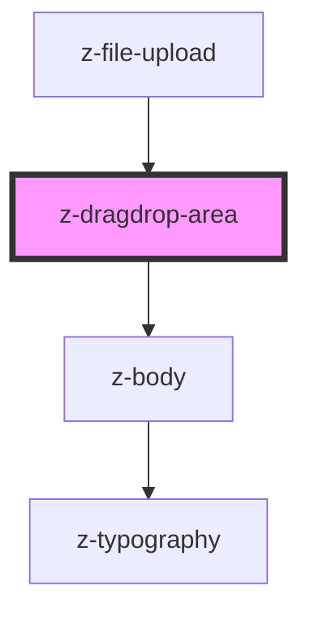

# z-dragdrop-area

<!-- Auto Generated Below -->

## Events

| Event         | Description                              | Type               |
| ------------- | ---------------------------------------- | ------------------ |
| `fileDropped` | Emitted when user drop one or more files | `CustomEvent<any>` |

## Dependencies

### Used by

 - [z-file-upload](../z-file-upload)

### Depends on

- [z-body](../../typography/z-body)

### Graph

----------------------------------------------

*Built with [StencilJS](https://stenciljs.com/)*
