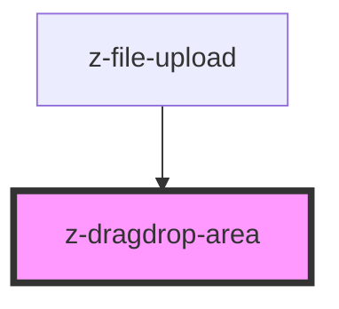

# z-dragdrop-area

<!-- Auto Generated Below -->

## Properties

| Property           | Attribute             | Description              | Type     | Default     |
| ------------------ | --------------------- | ------------------------ | -------- | ----------- |
| `dragAndDropLabel` | `drag-and-drop-label` | drag & drop button label | `string` | `undefined` |

## Events

| Event         | Description                              | Type               |
| ------------- | ---------------------------------------- | ------------------ |
| `fileDropped` | Emitted when user drop one or more files | `CustomEvent<any>` |

## Dependencies

### Used by

 - [z-file-upload](../z-file-upload)

### Graph

----------------------------------------------

*Built with [StencilJS](https://stenciljs.com/)*
