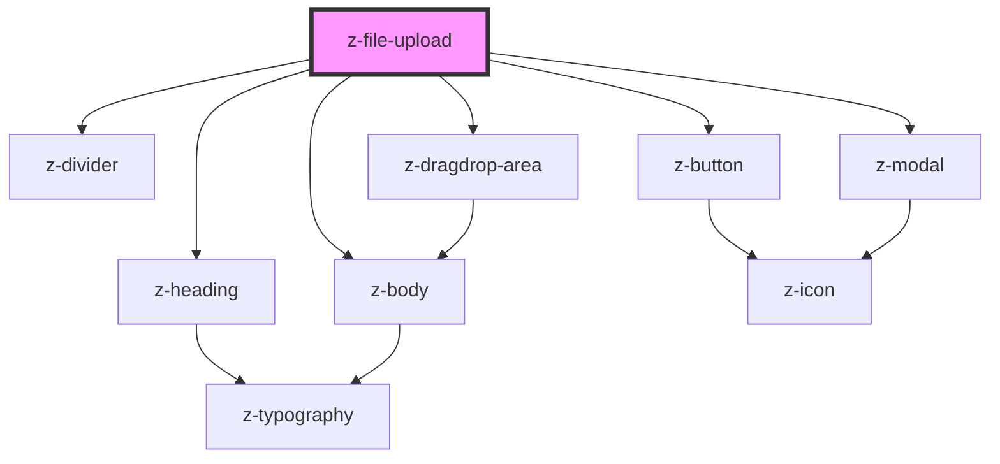

# z-file-upload

<!-- Auto Generated Below -->

## Properties

| Property         | Attribute         | Description                                                       | Type                                                                                                  | Default                   |
| ---------------- | ----------------- | ----------------------------------------------------------------- | ----------------------------------------------------------------------------------------------------- | ------------------------- |
| `acceptedFormat` | `accepted-format` | Prop indicating the accepted file type: ex ".pdf, .doc, .jpg"     | `string`                                                                                              | `undefined`               |
| `buttonVariant`  | `button-variant`  | Prop indicating the button variant                                | `ButtonVariant.DARK_BG \| ButtonVariant.PRIMARY \| ButtonVariant.SECONDARY \| ButtonVariant.TERTIARY` | `undefined`               |
| `description`    | `description`     | Description                                                       | `string`                                                                                              | `undefined`               |
| `fileMaxSize`    | `file-max-size`   | Max file dimension in Megabyte                                    | `number`                                                                                              | `undefined`               |
| `mainTitle`      | `main-title`      | Title                                                             | `string`                                                                                              | `undefined`               |
| `type`           | `type`            | Prop indicating the file upload type - can be default or dragdrop | `ZFileUploadType.DEFAULT \| ZFileUploadType.DRAGDROP`                                                 | `ZFileUploadType.DEFAULT` |

## Events

| Event       | Description                                | Type               |
| ----------- | ------------------------------------------ | ------------------ |
| `fileInput` | Emitted when user select one or more files | `CustomEvent<any>` |

## Methods

### `getFiles() => Promise<File[]>`

get array of uploaded files

#### Returns

Type: `Promise<File[]>`

## Dependencies

### Depends on

- [z-heading](../../typography/z-heading)
- [z-body](../../typography/z-body)
- [z-divider](../../z-divider)
- [z-button](../../buttons/z-button)
- [z-dragdrop-area](../z-dragdrop-area)
- [z-modal](../../modal/z-modal)

### Graph

----------------------------------------------

*Built with [StencilJS](https://stenciljs.com/)*
