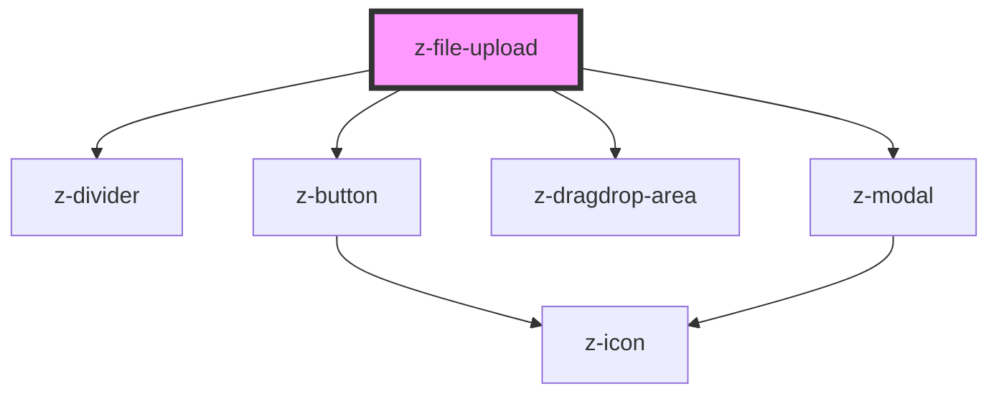

# z-file-upload

<!-- Auto Generated Below -->

## Properties

| Property           | Attribute             | Description                                                       | Type                                                                         | Default                                           |
| ------------------ | --------------------- | ----------------------------------------------------------------- | ---------------------------------------------------------------------------- | ------------------------------------------------- |
| `acceptedFormat`   | `accepted-format`     | Prop indicating the accepted file type: ex ".pdf, .doc, .jpg"     | `string`                                                                     | `undefined`                                       |
| `buttonVariant`    | `button-variant`      | Prop indicating the button variant                                | `ButtonVariant.PRIMARY \| ButtonVariant.SECONDARY \| ButtonVariant.TERTIARY` | `undefined`                                       |
| `description`      | `description`         | Description                                                       | `string`                                                                     | `undefined`                                       |
| `dragAndDropLabel` | `drag-and-drop-label` | drag & drop button label                                          | `string`                                                                     | `"Rilascia i file in questa area per allegarli."` |
| `fileMaxSize`      | `file-max-size`       | Max file dimension in Megabyte                                    | `number`                                                                     | `undefined`                                       |
| `hasFileSection`   | `has-file-section`    | uploaded files history rendering                                  | `boolean`                                                                    | `true`                                            |
| `mainTitle`        | `main-title`          | Title                                                             | `string`                                                                     | `undefined`                                       |
| `type`             | `type`                | Prop indicating the file upload type - can be default or dragdrop | `ZFileUploadType.DEFAULT \| ZFileUploadType.DRAGDROP`                        | `ZFileUploadType.DEFAULT`                         |
| `uploadBtnLabel`   | `upload-btn-label`    | upoload button label                                              | `string`                                                                     | `"allega"`                                        |

## Events

| Event       | Description                                | Type               |
| ----------- | ------------------------------------------ | ------------------ |
| `fileInput` | Emitted when user select one or more files | `CustomEvent<any>` |

## Methods

### `getFiles() => Promise<File[]>`

get array of uploaded files

#### Returns

Type: `Promise<File[]>`

### `removeFile(fileName: string) => Promise<void>`

remove file from the array

#### Parameters

| Name       | Type     | Description |
| ---------- | -------- | ----------- |
| `fileName` | `string` |             |

#### Returns

Type: `Promise<void>`

## Dependencies

### Depends on

- [z-divider](../../z-divider)
- [z-button](../../z-button)
- [z-dragdrop-area](../z-dragdrop-area)
- [z-modal](../../z-modal)

### Graph

----------------------------------------------

*Built with [StencilJS](https://stenciljs.com/)*
