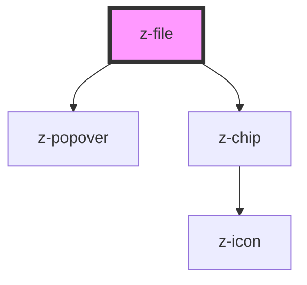

# z-file

<!-- Auto Generated Below -->

## Properties

| Property     | Attribute     | Description  | Type     | Default     |
| ------------ | ------------- | ------------ | -------- | ----------- |
| `fileName`   | `file-name`   | File name    | `string` | `undefined` |
| `fileNumber` | `file-number` | File chip id | `number` | `undefined` |

## Events

| Event        | Description                                             | Type               |
| ------------ | ------------------------------------------------------- | ------------------ |
| `removeFile` | Emitted when a z-file component is removed from the DOM | `CustomEvent<any>` |

## Dependencies

### Depends on

- [z-popover](../../z-popover)
- [z-chip](../../z-chip)

### Graph

----------------------------------------------

*Built with [StencilJS](https://stenciljs.com/)*
