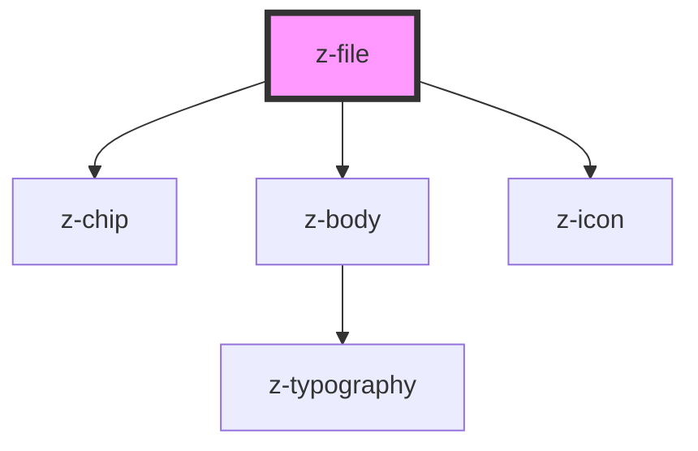

# z-file

<!-- Auto Generated Below -->

## Events

| Event        | Description                                             | Type               |
| ------------ | ------------------------------------------------------- | ------------------ |
| `removeFile` | Emitted when a z-file component is removed from the DOM | `CustomEvent<any>` |

## Dependencies

### Depends on

- [z-chip](../../buttons/z-chip)
- [z-body](../../typography/z-body)
- [z-icon](../../icons/z-icon)

### Graph

----------------------------------------------

*Built with [StencilJS](https://stenciljs.com/)*
