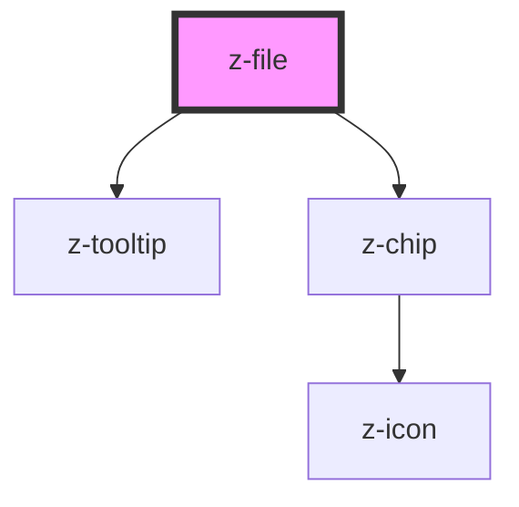

# z-file

<!-- Auto Generated Below -->

## Properties

| Property     | Attribute     | Description | Type     | Default     |
| ------------ | ------------- | ----------- | -------- | ----------- |
| `fileName`   | `file-name`   | File name   | `any`    | `undefined` |
| `fileNumber` | `file-number` |             | `number` | `undefined` |

## Events

| Event        | Description                                             | Type               |
| ------------ | ------------------------------------------------------- | ------------------ |
| `removeFile` | Emitted when a z-file component is removed from the DOM | `CustomEvent<any>` |

## Dependencies

### Depends on

- [z-tooltip](../../notification/z-tooltip)
- [z-chip](../../buttons/z-chip)

### Graph

----------------------------------------------

*Built with [StencilJS](https://stenciljs.com/)*
