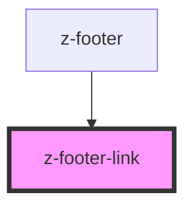

# z-footer-link

<!-- Auto Generated Below -->

## Properties

| Property | Attribute | Description | Type     | Default     |
| -------- | --------- | ----------- | -------- | ----------- |
| `href`   | `href`    | link        | `string` | `undefined` |

## Slots

| Slot | Description |
| ---- | ----------- |
|      | link label  |

## Dependencies

### Used by

 - [z-footer](../z-footer)

### Graph

----------------------------------------------

*Built with [StencilJS](https://stenciljs.com/)*
