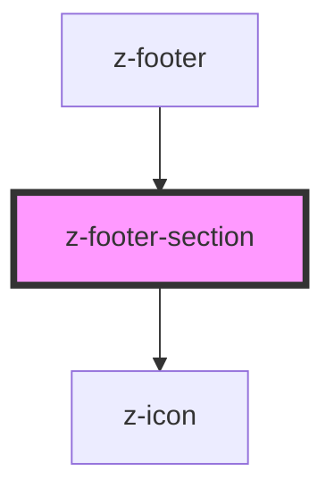

# z-footer-section

<!-- Auto Generated Below -->

## Properties

| Property | Attribute | Description   | Type     | Default     |
| -------- | --------- | ------------- | -------- | ----------- |
| `name`   | `name`    | section title | `string` | `undefined` |

## Slots

| Slot | Description     |
| ---- | --------------- |
|      | section content |

## Dependencies

### Used by

 - [z-footer](../z-footer)

### Depends on

- [z-icon](../../icons/z-icon)

### Graph

----------------------------------------------

*Built with [StencilJS](https://stenciljs.com/)*
