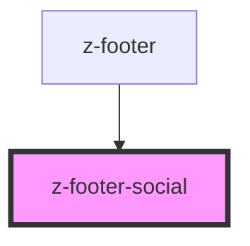

# z-footer-social

<!-- Auto Generated Below -->

## Properties

| Property      | Attribute     | Description        | Type     | Default     |
| ------------- | ------------- | ------------------ | -------- | ----------- |
| `description` | `description` | social description | `string` | `undefined` |
| `href`        | `href`        | social link        | `string` | `undefined` |
| `icon`        | `icon`        | icon url           | `string` | `undefined` |

## Dependencies

### Used by

- [z-footer](../z-footer)

### Graph

---

_Built with [StencilJS](https://stenciljs.com/)_
