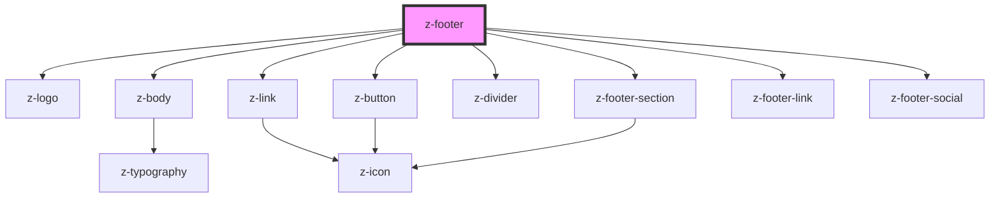

# z-footer

<!-- readme-group="footer" -->

<!-- Auto Generated Below -->

## Properties

| Property                   | Attribute                      | Description                                                                                 | Type      | Default     |
| -------------------------- | ------------------------------ | ------------------------------------------------------------------------------------------- | --------- | ----------- |
| `contentMaxWidth`          | `content-max-width`            | Maximum width of footer content                                                             | `number`  | `undefined` |
| `data`                     | `data`                         | deprecated - JSON stringified data to fill the footer                                       | `string`  | `undefined` |
| `productCreditsLink`       | `product-credits-link`         | The URL of the product credits to be displayed on the top panel of the footer               | `string`  | `undefined` |
| `productName`              | `product-name`                 | The product name to be displayed on the top panel of the footer                             | `string`  | `undefined` |
| `productVersion`           | `product-version`              | The product version to be displayed on the top panel of the footer                          | `string`  | `undefined` |
| `showReportAProblemButton` | `show-report-a-problem-button` | True if the product must display a "Report a problem" button on the top panel of the footer | `boolean` | `undefined` |

## Events

| Event                       | Description | Type               |
| --------------------------- | ----------- | ------------------ |
| `reportAProblemButtonClick` |             | `CustomEvent<any>` |

## Slots

| Slot       | Description       |
| ---------- | ----------------- |
|            | main navigation   |
| `"links"`  | bottom navigation |
| `"social"` | social links      |

## Dependencies

### Depends on

- [z-logo](../../logo/z-logo)
- [z-body](../../typography/z-body)
- [z-link](../../navigation/z-link)
- [z-button](../../buttons/z-button)
- [z-divider](../../z-divider)
- [z-footer-section](../z-footer-section)
- [z-footer-link](../z-footer-link)
- [z-footer-social](../z-footer-social)

### Graph

----------------------------------------------

*Built with [StencilJS](https://stenciljs.com/)*
