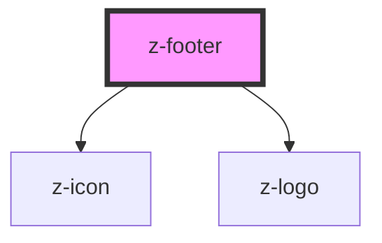

# z-footer

<!-- readme-group="footer" -->
```html
<z-footer copyrightuser='Zanichelli' data='{
      "zanichelliLinks": [{
          "title": "Zanichelli.it",
          "items": [{
              "label": "Home zanichelli.it",
              "link": "https://www.zanichelli.it"
          }, {
              "label": "Ricerca in catalogo",
              "link": "https://www.zanichelli.it/ricerca"
          }, {
              "label": "Contatti",
              "link": "https://www.zanichelli.it/contatti-e-recapiti"
          }]
      }, {
          "title": "Scuola",
          "items": [{
              "label": "Home scuola",
              "url": "https://www.zanichelli.it/scuola/in-primo-piano"
          }, {
              "label": "Catalogo scuola",
              "url": "https://www.zanichelli.it/scuola/novita-e-proposte"
          }, {
              "label": "Bisogni Educativi Speciali (BES)",
              "url": "https://www.zanichelli.it/scuola/la-nostra-proposta-per-i-bisogni-educativi-speciali"
          }, {
              "label": "Formazione docenti",
              "url": "https://www.zanichelli.it/scuola/formazione-e-aggiornamento"
          }]
      }, {
          "title": "Siti per la scuola",
          "items": [{
              "label": "Siti dei libri di testo",
              "link": "https://www.zanichelli.it/scuola/siti-dei-libri-di-testo"
          }, {
              "label": "ZTE Zanichelli Test",
              "link": "http://zte.zanichelli.it/"
          }, {
              "label": "Verso l esame di stato",
              "link": "http://online.scuola.zanichelli.it/esamedistato"
          }, {
              "label": "La seconda prova di matematica e fisica",
              "link": "http://online.scuola.zanichelli.it/provamatematicafisica/"
          }, {
              "label": "Collezioni",
              "link": "http://collezioni.scuola.zanichelli.it/"
          }, {
              "label": "Crea Verifiche",
              "link": "https://creaverifiche.zanichelli.it"
          }, {
              "label": "Biblioteca",
              "link": "https://biblioteca.scuola.zanichelli.it"
          }, {
              "label": "Tavola periodica interattiva",
              "link": "https://tavolaperiodica.zanichelli.it/it"
          }, {
              "label": "Tutte le prove",
              "link": "http://online.scuola.zanichelli.it/tutteleprove/"
          }, {
              "label": "Verso l INVALSI",
              "link": "http://online.scuola.zanichelli.it/invalsi/"
          }, {
              "label": "La certificazione delle competenze",
              "link": "http://online.scuola.zanichelli.it/competenze/"
          }, {
              "label": "Tutti i siti Zanichelli per la scuola",
              "link": "https://www.zanichelli.it/scuola/siti-per-la-scuola"
          }]
      },{
          "title": "Università",
          "items": [{
              "label": "Home università",
              "link": "https://www.zanichelli.it/universita/in-primo-piano"
          }, {
              "label": "Catalogo università",
              "link": "https://www.zanichelli.it/universita/novita-e-proposte"
          }, {
              "label": "Area docenti",
              "link": "https://www.zanichelli.it/universita/informazioni-e-contatti-docenti"
          }, {
              "label": "Area studenti",
              "link": "https://www.zanichelli.it/universita/risorse-online-studenti"
          }, {
              "label": "Preparazione test di ammissione",
              "link": "http://online.scuola.zanichelli.it/unitutor/"
          }, {
              "label": "ZTE università",
              "link": "http://zte.universita.zanichelli.it/"
          }, {
              "label": "ZTE UniTutor",
              "link": "http://zte.unitutor.zanichelli.it/"
          }, {
              "label": "Collezioni Università",
              "link": "https://collezioni-universita.zanichelli.it/"
          }]
      },{
          "title": "Dizionari",
          "items": [{
              "label": "Home dizionari",
              "link": "https://www.zanichelli.it/dizionari/in-primo-piano"
          }, {
              "label": "Catalogo dizionari",
              "link": "https://www.zanichelli.it/dizionari/novita-e-proposte"
          }, {
              "label": "Dizionari digitali",
              "link": "http://dizionari.zanichelli.it/"
          }, {
              "label": "Dizionari Pi\u00f9",
              "link": "http://dizionaripiu.zanichelli.it/"
          }]
      },{
          "title": "Altri settori",
          "items": [{
              "label": "Giuridico",
              "link": "https://www.zanichelli.it/giuridico/in-primo-piano"
          }, {
              "label": "Manuali e saggi",
              "link": "https://www.zanichelli.it/saggistica/argomenti"
          }, {
              "label": "Medico professionale",
              "link": "https://www.zanichelli.it/medico-professionale"
          }]
      }],
      "myzLink": {
          "label": "Home MyZanichelli",
          "link": "https://my.zanichelli.it",
          "img": "../../assets/images/png/zanichelli-logo-2.png"
      },
      "zanichelliAddress": "Zanichelli editore S.p.A. via Irnerio 34, 40126 Bologna\nFax 051 - 249.782 / 293.224 | Tel. 051 - 293.111 / 245.024\nPartita IVA 03978000374",
      "social": [{
          "icon": "../../assets/images/png/facebook.png",
          "link": "https://it-it.facebook.com/zanichelliscuola",
          "description" : "facebook"
      },{
          "icon": "../../assets/images/png/youtube.png",
          "link": "https://www.youtube.com/user/zanichellieditore",
          "description" : "youtube"
      },{
          "icon": "../../assets/images/png/twitter.png",
          "link": "https://twitter.com/zanichelli_ed",
          "description" : "twitter"
      },{
          "icon": "../../assets/images/png/instagram.png",
          "link": "https://www.instagram.com/zanichellieditore/",
          "description" : "instagram"
      }],
      "certification": "Zanichelli editore S.p.A. opera con sistema qualità certificato CertiCarGraf n. 477\nsecondo la norma UNI EN ISO 9001:2015",
      "bottomLinks": [{
          "label": "Chi siamo",
          "link": "https://www.zanichelli.it/chi-siamo/via-irnerio-34"
      },{
          "label": "Contatti e recapiti",
          "link": "https://www.zanichelli.it/contatti-e-recapiti"
      },{
          "label": "Area stampa",
          "link": "https://www.zanichelli.it/comunicazione/area-stampa"
      },{
          "label": "Per acqusti online",
          "link": "https://www.zanichelli.it/contatti/acquisti-e-recesso"
      },{
          "label": "Filiali e agenzie",
          "link": "https://www.zanichelli.it/contatti/filiali-e-agenzie"
      },{
          "label": "Privacy",
          "link": "https://my.zanichelli.it/privacy"
      }]
  }'></z-footer>
```

<!-- Auto Generated Below -->


## Properties

| Property        | Attribute       | Description                              | Type     | Default     |
| --------------- | --------------- | ---------------------------------------- | -------- | ----------- |
| `copyrightuser` | `copyrightuser` | set copyright user (optional)            | `any`    | `undefined` |
| `data`          | `data`          | JSON stringified data to fill the footer | `string` | `undefined` |


## Dependencies

### Depends on

- [z-icon](../../icons/z-icon)
- [z-logo](../../logo/z-logo)

### Graph


----------------------------------------------

*Built with [StencilJS](https://stenciljs.com/)*
