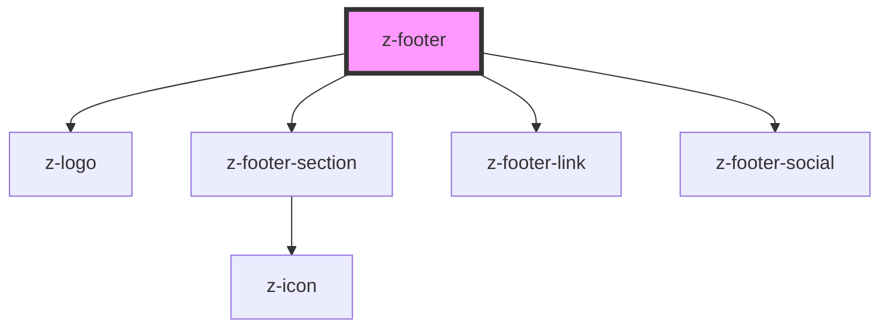

# z-footer

<!-- readme-group="footer" -->

<!-- Auto Generated Below -->

## Properties

| Property        | Attribute       | Description                                           | Type     | Default     |
| --------------- | --------------- | ----------------------------------------------------- | -------- | ----------- |
| `copyrightuser` | `copyrightuser` | deprecated - set copyright user                       | `string` | `undefined` |
| `data`          | `data`          | deprecated - JSON stringified data to fill the footer | `string` | `undefined` |

## Slots

| Slot       | Description       |
| ---------- | ----------------- |
|            | main navigation   |
| `"links"`  | bottom navigation |
| `"social"` | social links      |

## Dependencies

### Depends on

- [z-logo](../../logo/z-logo)
- [z-footer-section](../z-footer-section)
- [z-footer-link](../z-footer-link)
- [z-footer-social](../z-footer-social)

### Graph

---

_Built with [StencilJS](https://stenciljs.com/)_
