# z-icon

<!-- readme-group="icon" -->
```html
<z-icon name="book-add" ></z-icon>
<z-icon name="chevron-down" iconid="zicon"></z-icon>
<z-icon name="download" iconid="zicon" width="10" height="10"></z-icon>
```

<!-- Auto Generated Below -->


## Properties

| Property | Attribute | Description                                | Type     | Default     |
| -------- | --------- | ------------------------------------------ | -------- | ----------- |
| `height` | `height`  | icon height (optional)                     | `number` | `18`        |
| `iconid` | `iconid`  | icon id (optional)                         | `string` | `undefined` |
| `name`   | `name`    | icon name (choice between available icons) | `string` | `undefined` |
| `width`  | `width`   | icon width (optional)                      | `number` | `18`        |


## Dependencies

### Used by

 - [z-button](../../buttons/z-button)
 - [z-button-filter](../../buttons/z-button-filter)
 - [z-button-sort](../../buttons/z-button-sort)
 - [z-card-alert](../../card/z-card-alert)
 - [z-card-icon](../../card/z-card-icon)
 - [z-combobox](../../inputs/z-combobox)
 - [z-footer](../../footer/z-footer)
 - [z-header](../../navigation/z-header)
 - [z-icon-package](../z-icon-package)
 - [z-info-box](../../notification/z-info-box)
 - [z-input](../../inputs/z-input)
 - [z-link](../../navigation/z-link)
 - [z-list-item](../../list/z-list-item)
 - [z-menu-dropdown](../../navigation/z-menu-dropdown)
 - [z-modal](../../modal/z-modal)
 - [z-pagination-bar](../../pagination/z-pagination-bar)
 - [z-pocket](../../notification/z-pocket)
 - [z-slideshow](../../slideshow/z-slideshow)
 - [z-toggle-button](../../buttons/z-toggle-button)

### Graph

```mermaid
graph TD;
  z-button --> z-icon
  z-button-filter --> z-icon
  z-button-sort --> z-icon
  z-card-alert --> z-icon
  z-card-icon --> z-icon
  z-combobox --> z-icon
  z-footer --> z-icon
  z-header --> z-icon
  z-icon-package --> z-icon
  z-info-box --> z-icon
  z-input --> z-icon
  z-link --> z-icon
  z-list-item --> z-icon
  z-menu-dropdown --> z-icon
  z-modal --> z-icon
  z-pagination-bar --> z-icon
  z-pocket --> z-icon
  z-slideshow --> z-icon
  z-toggle-button --> z-icon
  style z-icon fill:#f9f,stroke:#333,stroke-width:4px
```


----------------------------------------------

*Built with [StencilJS](https://stenciljs.com/)*
