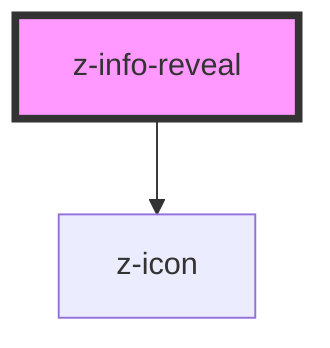

# z-info-reveal

<!-- Auto Generated Below -->

## Properties

| Property   | Attribute  | Description                                              | Type                                                                                                                               | Default                           |
| ---------- | ---------- | -------------------------------------------------------- | ---------------------------------------------------------------------------------------------------------------------------------- | --------------------------------- |
| `icon`     | `icon`     | Name of the icon for the open button                     | `string`                                                                                                                           | `'informationsource'`             |
| `label`    | `label`    | Text that appears on closed panel aside the open button. | `string`                                                                                                                           | `undefined`                       |
| `position` | `position` | Position of the panel.                                   | `InfoRevealPosition.BOTTOM_LEFT \| InfoRevealPosition.BOTTOM_RIGHT \| InfoRevealPosition.TOP_LEFT \| InfoRevealPosition.TOP_RIGHT` | `InfoRevealPosition.BOTTOM_RIGHT` |

## Dependencies

### Depends on

- [z-icon](../icons/z-icon)

### Graph

----------------------------------------------

*Built with [StencilJS](https://stenciljs.com/)*
