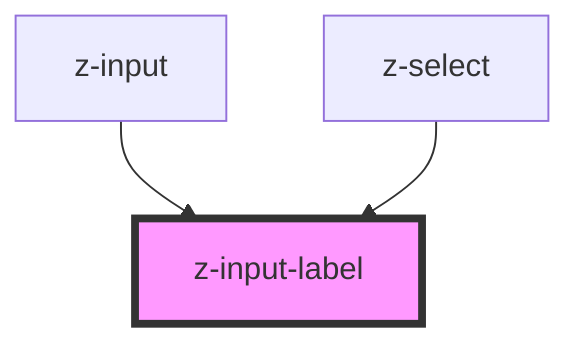

# z-input-label

<!-- Auto Generated Below -->

## Properties

| Property   | Attribute  | Description           | Type      | Default     |
| ---------- | ---------- | --------------------- | --------- | ----------- |
| `disabled` | `disabled` | the label is disabled | `boolean` | `false`     |
| `value`    | `value`    | the label value       | `string`  | `undefined` |

## Dependencies

### Used by

- [z-input](../z-input)
- [z-select](../z-select)

### Graph

---

_Built with [StencilJS](https://stenciljs.com/)_
