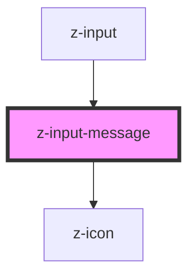

# z-input-message

<!-- Auto Generated Below -->

## Properties

| Property  | Attribute | Description             | Type                                                                          | Default     |
| --------- | --------- | ----------------------- | ----------------------------------------------------------------------------- | ----------- |
| `message` | `message` | input helper message    | `string`                                                                      | `undefined` |
| `status`  | `status`  | input status (optional) | `InputStatusEnum.error \| InputStatusEnum.success \| InputStatusEnum.warning` | `undefined` |

## Dependencies

### Used by

 - [z-input](../z-input)

### Depends on

- [z-icon](../../icons/z-icon)

### Graph

----------------------------------------------

*Built with [StencilJS](https://stenciljs.com/)*
